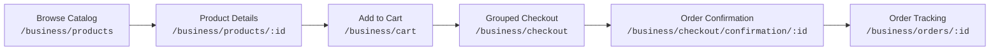
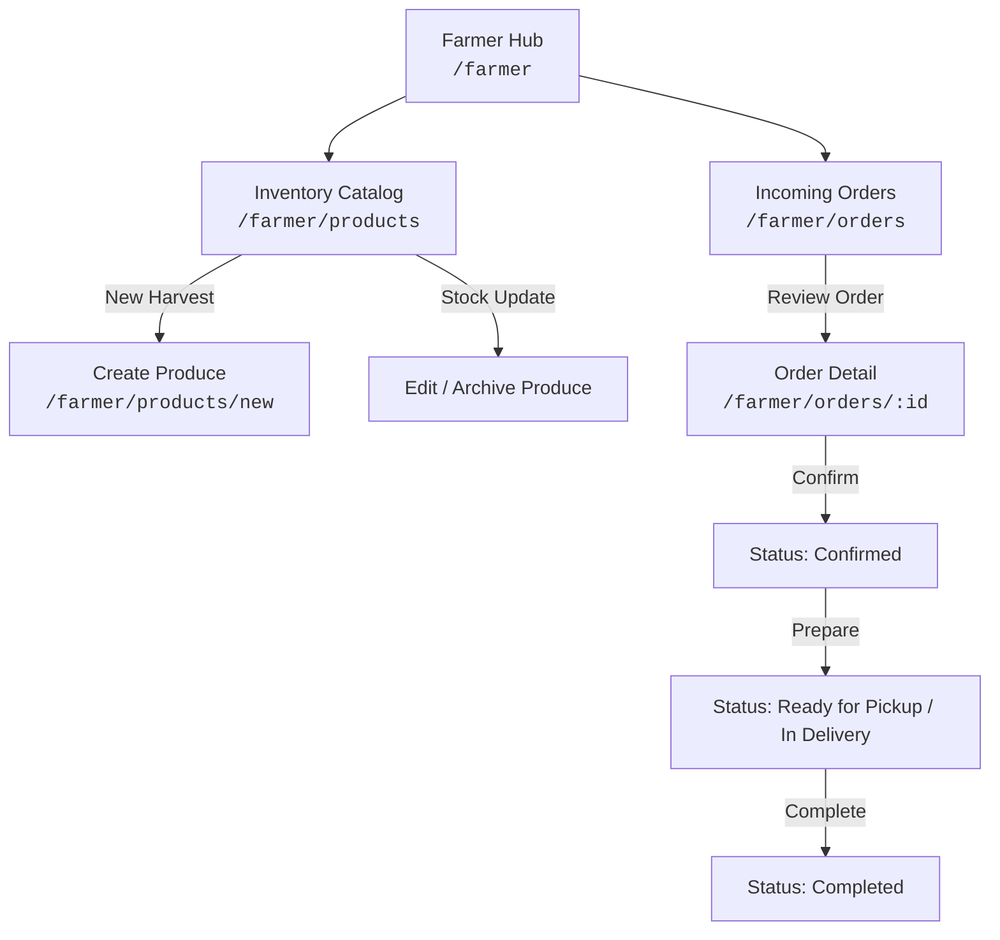
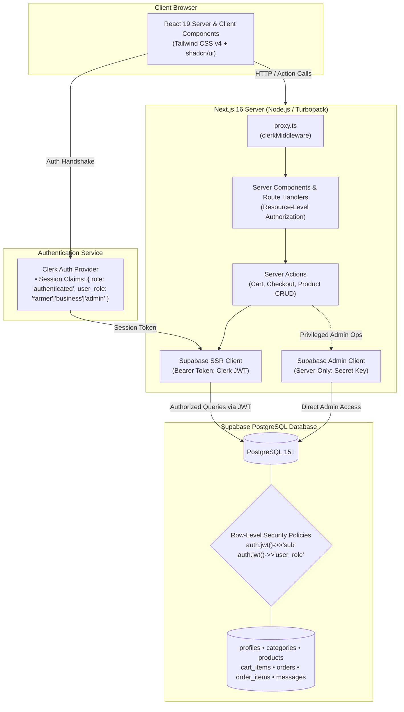
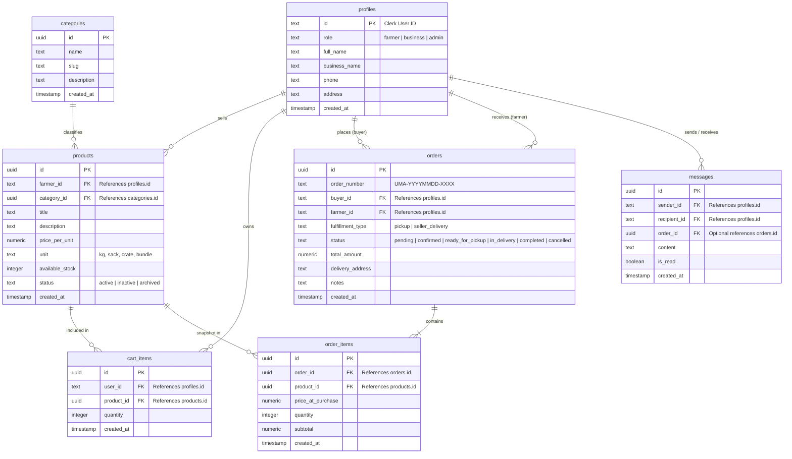

<div align="center">

  

  <br />
  <br />

  <h1>UMA Market</h1>

  <p><strong>FROM FARM TO BUSINESS.</strong></p>

  <p>
    A regional B2B agricultural procurement marketplace connecting local smallholder farms in Butuan City and Agusan del Norte directly with commercial food businesses.
  </p>

  <p>
    <a href="#what-is-uma-market">About</a> •
    <a href="#current-features">Features</a> •
    <a href="#architecture">Architecture</a> •
    <a href="#technology-stack">Tech Stack</a> •
    <a href="#security--authorization">Security</a> •
    <a href="#database-overview">Database</a> •
    <a href="#local-development-setup">Setup</a> •
    <a href="#roadmap--future-scope">Roadmap</a>
  </p>

  <p>
    
    
    
    
    
    
    
    
  </p>

</div>

---

## 1. What is UMA Market?

**UMA Market** is a dedicated direct-trade agricultural procurement platform built for regional food supply chains. Designed specifically for the agricultural context of **Butuan City and Agusan del Norte**, UMA Market eliminates predatory intermediary middlemen by establishing a transparent, digital B2B channel between agricultural producers (farmers, farm cooperatives) and commercial buyers (restaurants, caterers, hotels, canteens, and food retailers).

Instead of relying on fragmented dawn spot-markets, telephone bargaining, and speculative layers of traders, businesses can discover fresh harvests in bulk, review transparent per-unit pricing, group orders by producer, and arrange reliable local fulfillment—all within a unified, modern web application.

---

## 2. Core Problem

Agricultural distribution in regional centers like Butuan City is hampered by inefficiencies on both sides of the market:

```text
TRADITIONAL SUPPLY CHAIN:
[ Smallholder Farmer ] ──(Low Gate Price)──> [ Middlemen / Traders ] ──(Spreads / Markups)──> [ Wholesalers ] ──(High Volatility)──> [ Business Buyer ]
  • Receives 30-40% of retail value              • High post-harvest waste                      • Inconsistent quality
  • No demand visibility                         • Speculative hoarding                         • Unpredictable daily pricing
```

- **For Local Farmers:**
  - **Severe Margin Erosion:** Smallholder farmers often capture less than 35% of the end retail value of their harvest due to multi-tiered brokers and financiers.
  - **Zero Demand Predictability:** Farmers harvest blindly without firm commitments, causing catastrophic post-harvest spoilage and panic-selling below production cost.
  - **Market Access Barriers:** Individual small farms lack the sales channels, invoicing tools, and digital reach to supply institutional buyers directly.

- **For Commercial Food Businesses:**
  - **Price & Supply Volatility:** Restaurants and caterers experience sudden shortages and wild price spikes in local wet markets.
  - **Operational Inefficiency:** Kitchen managers spend early morning hours traveling to central markets, inspecting produce manually, and managing unreceipted cash transactions.
  - **Lack of Provenance:** Buyers cannot verify harvest dates, farming practices, or producer authenticity.

---

## 3. Solution

UMA Market restructures the local procurement workflow into a direct, digital commerce model:

```text
UMA MARKET DIRECT PROCUREMENT:
[ Local Farm / Producer ] ═══════════════ UMA MARKET B2B PLATFORM ═══════════════> [ Commercial Business ]
  • Sets fair farm-gate prices             • Verified Role-Based Workspaces             • Transparent wholesale catalog
  • Direct wholesale order stream          • Automated Per-Farmer Order Grouping        • Predictable supply & lead time
  • Clear fulfillment scheduling           • Built-in Row-Level Security Policies       • Direct pickup or seller delivery
```

1. **Direct Farm-Gate Listings:** Farmers publish available produce directly with transparent bulk pricing (PHP/kg, bundle, crate), minimum order quantities (MOQ), and realistic fulfillment options.
2. **Multi-Producer Cart & Smart Order Splitting:** Business buyers can shop across multiple regional farms in a single session; the system automatically groups items into distinct, manageable purchase orders per farmer at checkout.
3. **Pragmatic Regional Fulfillment:** Support for direct farm pickup or seller delivery, matching the realistic logistical capabilities of local producers without requiring speculative third-party courier infrastructure.
4. **Institutional Security & Role Segregation:** Robust identity management powered by Clerk and database-level Row-Level Security (RLS) in Supabase PostgreSQL guarantees multi-tenant isolation.

---

## 4. Current Features

The application is currently implemented through **Slice 1 (Foundation)** and **Slice 2 (Business Purchasing Journey & Farmer Operations)**:

### 🛍️ Business Buyer Experience
- **Produce Catalog Browsing:** Filter fresh produce by agricultural categories (Vegetables, Fruits, Grains & Rice, Herbs & Spices, Root Crops) with live instant search.
- **Produce Detail View:** Full product inspection showing farmer name, harvest availability, stock level, unit measurement, and minimum order requirements.
- **Smart Grouped Cart:** Interactive shopping cart that groups items by farm producer with individual producer subtotals and real-time item quantity adjustment.
- **Streamlined B2B Checkout:** 
  - Choice of fulfillment mode: **Pickup** or **Seller Delivery**.
  - Shipping address and delivery notes input.
  - Order review with breakdown of product subtotals and estimated fulfillment costs.
- **Order Confirmation & Tracking:**
  - Automatic generation of formatted order references (e.g., `UMA-20260923-ABCD`).
  - Dedicated order detail views with complete itemization, fulfillment instructions, and a visual order progress timeline.
- **Order History:** Complete history of past and active purchase orders with status filtering.

### 🚜 Farmer Management Experience
- **Produce Inventory CRUD:**
  - Create new produce listings with crop name, category, pricing, packaging unit, available stock, and description.
  - Toggle listing availability (`active` vs `inactive`) to reflect harvest seasonality.
  - Edit pricing and inventory levels in real time.
- **Incoming Orders Dashboard:**
  - View all wholesale orders submitted by commercial buyers.
  - Inspect line items, requested fulfillment method, delivery addresses, and buyer details.
  - Lifecycle status transitions: `pending` → `confirmed` → `ready_for_pickup` / `in_delivery` → `completed` (or `cancelled`).

### 🔐 Platform Foundation & Authentication
- **Role-Based Authentication:** Handled via Clerk with dedicated user roles (`farmer`, `business`, `admin`) persisted in user metadata.
- **Custom Role Onboarding:** First-time user onboarding wizard ensuring every account is classified with proper business or farm credentials.
- **Automated Dashboard Routing:** Role-aware navigation redirecting farmers to `/farmer`, buyers to `/business`, and administrators to `/admin`.
- **Responsive Theme:** Clean, high-performance UI styled with Tailwind CSS v4, shadcn/ui design tokens, and restrained agricultural color accents.

---

## 5. User Roles

UMA Market defines three explicit, mutually exclusive system roles:

| Role | Target User | Primary Responsibilities |
|---|---|---|
| **Farmer** (`farmer`) | Smallholder farmers, farm managers, agricultural cooperatives | Manage crop catalog, set bulk units & prices, adjust harvest stock, process incoming wholesale orders, execute fulfillment. |
| **Business Buyer** (`business`) | Restaurants, caterers, hotels, canteens, institutional kitchens | Discover regional produce, manage procurement cart, submit orders grouped by farm, track fulfillment status. |
| **Admin** (`admin`) | Platform administrators, agricultural coordinators | Monitor platform activity, manage system categories, enforce marketplace trust and policy compliance. |

---

## 6. Main Purchase Journey

The business buyer purchasing flow is fully functional end-to-end:



1. **Browse Products (`/business/products`):** The buyer browses active produce listings, searches by keyword, or filters by agricultural categories.
2. **Product Detail (`/business/products/[id]`):** Inspects produce specifications, farm location, available stock, and selects order quantity.
3. **Cart Management (`/business/cart`):** Produce items are automatically sorted by farm. Quantities can be adjusted or removed with instant subtotal recalculation.
4. **Checkout (`/business/checkout`):** The buyer selects the desired fulfillment method (**Pickup** or **Seller Delivery**), enters delivery details or pickup schedule notes, and submits the order.
5. **Confirmation (`/business/checkout/confirmation/[orderId]`):** System generates an atomic order transaction, decrements inventory, clears relevant cart items, and displays order reference.
6. **Order Lifecycle (`/business/orders/[id]`):** Buyer tracks order progression through an interactive status timeline.

---

## 7. Farmer Workflow

Local producers have direct operational control over their harvest availability and incoming orders:



- **Catalog Management:** Add seasonal produce, update stock after harvest, and toggle listings active or inactive.
- **Order Handling:** Receive instant order notifications from commercial buyers, verify delivery requirements, and advance order state as crops are packed and dispatched.

---

## 8. Fulfillment Model

UMA Market employs a realistic, grounded fulfillment strategy tailored for Butuan City's regional geography:

| Fulfillment Mode | Operational Description | Typical Use Case |
|---|---|---|
| **Pickup** | The business buyer arranges their own vehicle or logistics to collect packed crates directly from the farm gate or designated aggregation point. | Cost-sensitive restaurants and caterers with their own transport seeking maximum freshness. |
| **Seller Delivery** | The farmer or cooperative delivers the consignment directly to the buyer's establishment or commercial kitchen using their own transport. | High-volume orders or farms with scheduled city delivery routes. |

> **Scope Discipline Note:** Automated third-party courier dispatch, on-demand motorcycle courier APIs, and live GPS tracking are intentionally excluded from the MVP scope. This design decision prioritizes practical local operations over unnecessary technical overhead.

---

## 9. Architecture

The system utilizes a modern, server-centric architecture leveraging **Next.js 16 App Router** with React Server Components, Server Actions, Clerk authentication, and Supabase PostgreSQL with native Row-Level Security:



---

## 10. Technology Stack

| Layer | Technology | Details |
|---|---|---|
| **Framework** | Next.js 16.3.5 | App Router, Server Components, Server Actions, Turbopack |
| **Language** | TypeScript 5 | Strict typing across queries, mutations, and component props |
| **Styling** | Tailwind CSS v4 | Native CSS configuration, zero-runtime compilation, modern tokens |
| **Component System** | shadcn/ui (`@base-ui/react`) | Accessible UI primitives with clean visual styling |
| **Iconography** | Remix Icons & Lucide | `@remixicon/react`, `lucide-react` |
| **Authentication** | Clerk (`@clerk/nextjs` v7) | Identity management, custom onboarding, public metadata roles |
| **Database** | Supabase PostgreSQL | Managed relational database, extensions, native JSONB support |
| **Database Security** | Supabase Row-Level Security | Granular policy enforcement directly on database tables |
| **Database Tooling** | Supabase CLI & SSR SDK | Declarative SQL migrations, `@supabase/ssr`, `@supabase/supabase-js` |
| **Code Quality** | ESLint 9 | Strict Next.js and React linting rules |

---

## 11. Security & Authorization

UMA Market implements a **defense-in-depth security model** uniting Clerk authentication with native Supabase PostgreSQL authorization:

```text
[ Incoming Request ]
        │
        ▼
[ proxy.ts (clerkMiddleware) ] ──> Attaches active Clerk session (does NOT contain role authorization)
        │
        ▼
[ Server Layout / Action ] ──> Performs resource-level verification & role checks
        │
        ▼
[ Clerk JWT Token Passed to Supabase SSR Client ]
  • Claims: { "role": "authenticated", "user_role": "<role>" }
        │
        ▼
[ Supabase PostgreSQL RLS Policies ]
  • auth.jwt()->>'sub'       => Identifies Clerk User ID
  • auth.jwt()->>'user_role' => Enforces UMA Role (farmer, business, admin)
```

- **Clerk as Identity Provider:** Clerk manages user credentials, multi-factor authentication, and session tokens. Role information is stored in Clerk user `publicMetadata.role`.
- **Native Third-Party Auth Integration:** Clerk is configured directly as a third-party auth provider inside the Supabase project. When database requests are made, the active Clerk session token is passed as the `Authorization: Bearer` token.
- **PostgreSQL Row-Level Security (RLS):** Every core table has RLS enabled. Policies verify the caller's identity via `auth.jwt()->>'sub'` and permissions via `auth.jwt()->>'user_role'`. Unauthenticated or unauthorized queries are rejected by PostgreSQL itself.
- **Resource-Level Authorization in Code:** Server Actions and Server Components independently verify resource ownership before processing mutations (e.g., verifying that a farmer can only update their own products and orders).
- **Separation of Concerns in `proxy.ts`:** Route interception in `proxy.ts` only invokes `clerkMiddleware()` for session establishment. It deliberately does **not** contain fragile role-based routing tables or wildcard path matchers.
- **Credential Protection:** The administrative `SUPABASE_SECRET_KEY` is restricted exclusively to server-only code paths and is never exposed in client bundles.

---

## 12. Database Overview

The platform database schema is managed via declarative SQL migrations (`supabase/migrations/`):



---

## 13. Project Structure

```text
uma-market/
├── .agents/                 # Workspace intelligence & skill guidelines
├── docs/                    # Project state, decisions, and development tracking
│   ├── CURRENT_STATE.md
│   ├── DECISIONS.md
│   └── PROGRESS.md
├── public/                  # Static assets & brand identity
│   ├── brand/
│   │   ├── icon/            # UMA brand icons
│   │   └── logo/            # UMA official logos (primary, inverse, monochrome)
│   └── hero-farm.jpg        # High-resolution hero imagery
├── src/
│   ├── app/                 # Next.js App Router
│   │   ├── (auth)/          # Authentication routes (sign-in, sign-up)
│   │   ├── (dashboard)/     # Protected role workspaces
│   │   │   ├── admin/       # Administrator hub & category management
│   │   │   ├── business/    # Commercial buyer hub, catalog, cart, checkout, orders
│   │   │   └── farmer/      # Farmer hub, inventory management, incoming orders
│   │   ├── onboarding/      # Role selection & profile completion flow
│   │   ├── layout.tsx       # Root layout & Clerk provider configuration
│   │   └── page.tsx         # Public marketing landing page
│   ├── components/          # Reusable UI & composite components
│   │   ├── dashboard/       # Role-specific navigation, sidebars, header
│   │   ├── landing/         # Hero section, feature grids, produce highlights
│   │   └── ui/              # shadcn/ui primitives (Button, Card, Input, Table, etc.)
│   ├── lib/
│   │   ├── supabase/        # Supabase client factories & query modules
│   │   │   ├── client.ts    # Browser client
│   │   │   ├── server.ts    # Server client with Clerk session token integration
│   │   │   ├── admin.ts     # Privileged server-only client (SUPABASE_SECRET_KEY)
│   │   │   └── queries/     # Encapsulated data-access layer (products, cart, orders)
│   │   └── utils.ts         # Utility helpers (cn, currency formatting)
│   └── proxy.ts             # Lightweight Clerk session middleware
├── supabase/
│   └── migrations/          # Declarative PostgreSQL schema migrations & RLS policies
├── .env.example             # Safe environment variables template
├── .gitignore               # Strict exclusion of secrets, builds, and artifacts
├── components.json          # shadcn configuration
├── next.config.ts           # Next.js configuration & remote image patterns
├── package.json             # Project dependencies & scripts
└── tsconfig.json            # TypeScript configuration
```

---

## 14. Local Development Setup

Follow these steps to set up and run UMA Market locally:

### Prerequisites
- **Node.js**: `v20.x` or later (LTS recommended)
- **Package Manager**: `npm` (v10+)
- **Git**
- **Accounts**:
  - [Clerk Account](https://dashboard.clerk.com) for authentication.
  - [Supabase Account](https://supabase.com) with an active project.

### 1. Clone the Repository
```bash
git clone https://github.com/xalhexi-sch/uma-market.git
cd uma-market
```

### 2. Install Dependencies
```bash
npm install
```

### 3. Configure Environment Variables
Copy the `.env.example` template to `.env.local`:
```bash
cp .env.example .env.local
```
Open `.env.local` and provide your Clerk and Supabase credentials (see [Environment Variables](#15-environment-variables)).

### 4. Apply Database Migrations
Apply the initial schema migrations to your Supabase project:
- Using the Supabase CLI:
  ```bash
  supabase link --project-ref your-project-ref
  supabase db push
  ```
- Or execute the SQL migration files directly in your **Supabase Dashboard SQL Editor**:
  1. `supabase/migrations/20260922000001_initial_schema.sql`
  2. `supabase/migrations/20260922000002_slice2_schema.sql`

### 5. Start the Development Server
```bash
npm run dev
```

Open [http://localhost:3000](http://localhost:3000) in your browser.

---

## 15. Environment Variables

The project requires the following environment variables configured in `.env.local`:

| Variable | Description | Environment | Example / Format |
|---|---|---|---|
| `NEXT_PUBLIC_CLERK_PUBLISHABLE_KEY` | Clerk publishable API key | Public (Browser) | `pk_test_...` |
| `CLERK_SECRET_KEY` | Clerk backend secret key | Server Only | `sk_test_...` |
| `NEXT_PUBLIC_CLERK_SIGN_IN_URL` | Route for sign-in page | Public | `/sign-in` |
| `NEXT_PUBLIC_CLERK_SIGN_UP_URL` | Route for registration page | Public | `/sign-up` |
| `NEXT_PUBLIC_CLERK_SIGN_IN_FALLBACK_REDIRECT_URL` | Post-login redirect fallback | Public | `/` |
| `NEXT_PUBLIC_CLERK_SIGN_UP_FALLBACK_REDIRECT_URL` | Post-registration redirect fallback | Public | `/onboarding` |
| `NEXT_PUBLIC_SUPABASE_URL` | Supabase project API URL | Public (Browser) | `https://<ref>.supabase.co` |
| `NEXT_PUBLIC_SUPABASE_PUBLISHABLE_KEY` | Supabase publishable/anon key | Public (Browser) | `sb_publishable_...` |
| `SUPABASE_SECRET_KEY` | Supabase admin secret key (bypasses RLS) | Server Only | `sb_secret_...` |

> ⚠️ **Security Warning:** Never commit `.env.local` or expose `CLERK_SECRET_KEY` and `SUPABASE_SECRET_KEY` to client-side code or public version control.

---

## 16. Current Development Status

UMA Market is an **actively developed MVP** implementing core vertical slices:

| Milestone / Slice | Scope | Status |
|---|---|---|
| **Slice 1: Platform Foundation** | Clerk auth, onboarding, role assignment, Supabase integration, RLS policies, 7 core tables, category seeds, dashboard shells | ✅ **Complete & Verified** |
| **Slice 2: Core Commerce** | Business product catalog, search & filtering, product detail, cart grouping, checkout, order creation, order tracking, farmer produce CRUD, farmer order management | ✅ **Complete & Verified** |
| **Slice 3: Communications & Operations** | Direct buyer-farmer messaging UI, profile management, advanced admin controls | ⏳ *Planned* |

**Verification Metrics:**
- Production build: `npm run build` passes with zero errors (21 static and dynamic routes).
- Linter: `npm run lint` passes with zero warnings.
- Database: All 7 tables secured by active Row-Level Security policies.

---

## 17. Roadmap / Future Scope

The following features represent future platform iterations and are not currently active in the MVP:

- [ ] **Supabase Storage Integration:** Cloud storage bucket for verified high-resolution produce photos and farmer farm-gate documentation.
- [ ] **Real-Time Direct Messaging:** In-app WebSocket chat between buyers and farmers for logistics coordination and inquiries.
- [ ] **Order Event Notifications:** Real-time push and email notifications for order status changes and delivery confirmations.
- [ ] **Digital Payment Gateway:** Integration with regional payment gateways (GCash, Maya, PESONet) for escrow-based settlements.
- [ ] **Advanced Admin Moderation:** Comprehensive resolution center for quality disputes, farmer verification badges, and category management.
- [ ] **Agricultural Analytics & Forecasting:** Supply forecasting based on seasonal harvest cycles in Agusan del Norte and commercial buyer demand trends.
- [ ] **Reputation & Review System:** Verified buyer reviews, harvest freshness ratings, and farmer reliability metrics.

---

## 18. Contributing

Contributions are welcomed to improve UMA Market. To contribute:

1. **Fork the Repository** on GitHub.
2. **Create a Feature Branch:**
   ```bash
   git checkout -b feature/your-feature-name
   ```
3. **Commit Your Changes:**
   ```bash
   git commit -m "feat: add descriptive feature summary"
   ```
4. **Push to Your Branch:**
   ```bash
   git push origin feature/your-feature-name
   ```
5. **Open a Pull Request:** Describe the rationale, testing steps, and architectural impact of your changes.

---

## 19. License

This project is licensed under the **MIT License**. See the [LICENSE](LICENSE) file for complete details.

---

<div align="center">
  <p><strong>UMA Market</strong> — Connecting Butuan's Farms to Businesses.</p>
</div>
