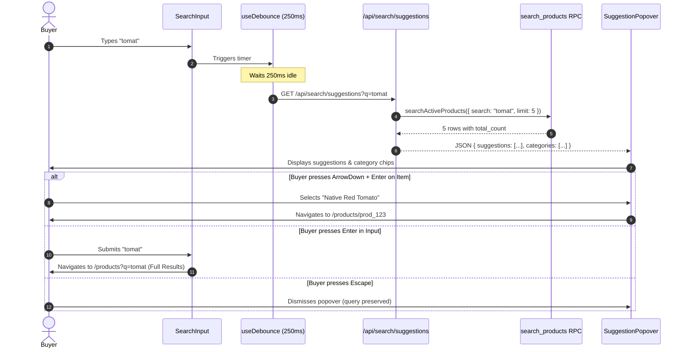

# Feature B — Marketplace / Visual Polish: Implementation Plan

**Roadmap Target:** Feature B — Marketplace / Visual Polish
**Status:** Approved & Implementation-Ready (Planning Only)
**Baseline Commit:** `13fe144` (`origin/main`)
**Production Site:** [https://uma.xalhexi.wtf](https://uma.xalhexi.wtf)
**Date:** September 2026
**Reference Audit:** [`docs/audits/marketplace/MARKETPLACE-VISUAL-AUDIT.md`](file:///c:/Users/mayke/OneDrive/Desktop/uma-market/docs/audits/marketplace/MARKETPLACE-VISUAL-AUDIT.md)

---

## 1. Executive Summary

Roadmap Feature A (*Smart Search & Discovery*) successfully deployed UMA Market's backend search engine: an authoritative PostgreSQL trigram RPC (`public.search_products`) with functional GIN indexes, typo tolerance, relevance weighting, and database-level pagination.

Feature B (*Marketplace / Visual Polish*) translates these backend capabilities into a cohesive, high-density, accessible frontend browsing experience. The purpose of Feature B is to eliminate UI drift between public and authenticated commercial buyer catalogs, provide immediate interactive feedback via a debounced live search autocomplete popover, enrich product cards with critical B2B procurement indicators (Minimum Order Quantity and producer provenance), eliminate Cumulative Layout Shift (CLS), and connect existing server-side pagination metadata to standard navigation controls.

This implementation plan strictly preserves UMA's existing business logic, ordering workflows, and database schemas. No database migrations, external packages, or breaking API changes will be introduced.

---

## 2. Approved Scope

The following ten items constitute the finalized and approved Feature B scope:

1. **Product Card Consolidation:** Merge `MarketplaceProductCard` and `ProductCard` into a single canonical component (`ProductCard`) with configurable variant support (`public` vs. `business`).
2. **Wholesale Metadata Visibility:** Surface Minimum Order Quantity (MOQ) and producer city/provenance on cards to empower commercial wholesale decisions.
3. **Dark-Mode & Visual Token Hardening:** Resolve dark-mode contrast defects on low-stock badges and align typography tokens.
4. **Skeleton CLS Correction:** Align skeleton image aspect ratios (`aspect-[4/3]`) to eliminate vertical layout shift during loading.
5. **Marketplace Header CTA Correction:** Fix the circular "Explore the market" link on `/products` for unauthenticated visitors by directing them to `/sign-up`.
6. **Desktop Filter Auto-Apply:** Trigger instant URL synchronization and grid updates when Sort or Availability dropdowns change, removing manual "Apply" clicks.
7. **Debounced Live Search & Autocomplete:** Implement a lightweight, keyboard-accessible suggestion popover (top 5 produce items + category chips) debounced at 250–300ms.
8. **Public & Business Catalog Parity:** Unify category pill styling (`rounded-full` scrollable pills) across both `/products` and `/business/products`.
9. **Business Product Detail Parity:** Add breadcrumb trails, structured provenance cards, and fulfillment explanations ("Farm Pickup" vs. "Seller Delivery") to `/business/products/[id]`.
10. **Frontend Pagination Integration:** Connect Feature A's RPC metadata (`totalCount`, `page`, `totalPages`) to accessible shadcn `Pagination` controls.

---

## 3. Phase-by-Phase Implementation Plan

### Phase 1: Product Card Foundation
**Objective:** Establish a single, canonical product card component and surface wholesale procurement metadata.

1. **Canonical Component Location:**
   Standardize on `src/components/marketplace/marketplace-product-card.tsx` as the single canonical implementation.
   Re-export this canonical card from `src/components/dashboard/product-card.tsx` as `export { MarketplaceProductCard as ProductCard } from "@/components/marketplace/marketplace-product-card";` to preserve existing imports in `(dashboard)/business/page.tsx` and `(dashboard)/business/products/page.tsx` without code duplication.
2. **Wholesale Metadata Visibility:**
   - **Minimum Order Quantity (MOQ):** Add a subtle, high-clarity badge or label beneath price: `MOQ: {product.min_order_quantity} {product.unit}`. If MOQ is 1, display `MOQ: 1 {product.unit}` to make order thresholds clear.
   - **Producer Location:** Display farmer business name + city (e.g., `From San Vicente Farms, Ampayon`).
   - **Verified Checkmark:** Ensure verified producer icon (`RiCheckboxCircleFill`) displays with accessible title tooltip and proper dark-mode green tokens (`text-emerald-600 dark:text-emerald-400`).
3. **Stock & Availability Tokens:**
   - In stock: `text-xs font-medium text-muted-foreground` (`{qty} {unit} available`).
   - Low stock (<= 10 units): Badge with hardened dark-mode tokens: `border-amber-300 bg-amber-50 text-amber-700 dark:border-amber-800 dark:bg-amber-950/30 dark:text-amber-400`.
   - Out of stock: Secondary badge: `<Badge variant="secondary">Out of stock</Badge>`.
4. **Card Layout & Typography:**
   - Lock image container to `relative aspect-[4/3] w-full overflow-hidden bg-muted`.
   - Title line clamping: `line-clamp-1` to prevent uneven card heights across responsive columns.
   - Price typography: `text-lg font-bold text-foreground` with `text-xs font-normal text-muted-foreground / {unit}`.
   - Micro-interaction: Subtle hover zoom on the image (`group-hover:scale-[1.03] transition-transform duration-300`) and border focus ring.

---

### Phase 2: Search Interaction & Autocomplete
**Objective:** Deliver real-time visual feedback as the user types without adding heavy external dependencies.

1. **Suggestion API Endpoint (`src/app/api/search/suggestions/route.ts`):**
   - Method: `GET`
   - Input: URL search parameter `?q=...`
   - Validation & Guardrails:
     - Minimum length: 2 characters. If shorter, return `{ suggestions: [], categories: [] }`.
     - Maximum length: 50 characters (prevent buffer/DoS abuse).
     - Sanitize input: Trim whitespace and control characters.
   - Query: Invoke `searchActiveProducts({ search: q, inStockOnly: true, limit: 5 })`.
   - Category Matches: Filter active categories matching `q` (max 2 categories).
   - Strict Privacy Boundary: Only return public produce metadata. Never expose farmer's phone, email, clerk ID, bio, or internal notes.
   - Response Payload:
     ```json
     {
       "suggestions": [
         {
           "id": "prod_123",
           "name": "Native Red Tomato",
           "price_per_unit": 65.0,
           "unit": "kg",
           "quantity_available": 150,
           "min_order_quantity": 10,
           "image_url": "https://...",
           "farmer_name": "San Vicente Organic Farm",
           "category_name": "Vegetables"
         }
       ],
       "categories": [
         { "name": "Vegetables", "slug": "vegetables" }
       ]
     }
     ```
   - Cache Header: `Cache-Control: public, s-maxage=30, stale-while-revalidate=60`.
2. **Frontend Autocomplete Component (`src/components/products/search-autocomplete.tsx`):**
   - Built on existing shadcn `Popover` and `Command` primitives.
   - Debounce: 250ms–300ms using a standard React hook/timeout.
   - State Machine:
     - `idle`: Popover closed.
     - `loading`: Subtle spinner or skeleton inside popover while fetching.
     - `success`: Display matching produce items and category quick-filters.
     - `empty`: "No matching produce found" message with hint to press Enter for full fuzzy catalog search.
   - Keyboard Navigation:
     - `ArrowDown` / `ArrowUp`: Move focus across suggestion items.
     - `Enter` on focused item: Navigate directly to product detail page (`/products/[id]`).
     - `Enter` on input without item selection: Submit full search query (`/products?q=...`).
     - `Escape`: Close suggestion popover and retain search query text.
     - Click outside: Close popover.
   - Mobile Handling: On viewports `< 640px`, anchor popover directly below the input at 100% width with touch-friendly suggestion item heights (min 48px).

---

### Phase 3: Filter UX & Auto-Apply
**Objective:** Eliminate redundant "Apply" clicks on desktop while preserving standard batch-apply behavior in the mobile sheet.

1. **Desktop Auto-Apply Behavior:**
   - In `src/components/products/product-filters.tsx`:
   - When the user selects a new Sort option from the `Select` dropdown, immediately trigger `handleApply({ sort: newSort })`.
   - When the user selects a new Availability option, immediately trigger `handleApply({ inStock: newInStock })`.
   - Active search query (`draftSearch`) and active category are preserved seamlessly in the URL.
2. **Desktop Button Refinement:**
   - Since Sort and Availability apply instantly, the desktop "Apply" button is redundant for selects.
   - Replace the generic "Apply" button with a dedicated search submit icon/button next to the search input, giving users an explicit click affordance for manual text queries while keeping dropdowns reactive.
3. **Mobile Sheet Preservation:**
   - The mobile `<Sheet>` (`< 640px`) retains its "Apply filters" button at the bottom of the drawer. Users expect to adjust multiple filters in a drawer before committing the change.

---

### Phase 4: Marketplace Parity & Detail Alignment
**Objective:** Eliminate visual drift between public and authenticated business surfaces.

1. **Category Pill Parity:**
   - Align `/business/products` category selector with `/products`.
   - Use identical pill styling: `rounded-full px-4 py-1.5 text-xs font-semibold whitespace-nowrap transition-colors border shadow-2xs`.
   - Container: `overflow-x-auto pb-1 pt-1 no-scrollbar flex items-center gap-2`.
2. **Skeleton CLS Correction:**
   - In `src/app/(dashboard)/business/products/page.tsx`, change `ProductGridSkeleton` from `aspect-square` to `aspect-[4/3]`.
   - Match real card padding and borders: `flex flex-col gap-3 rounded-xl border border-border p-4 bg-card`.
3. **Business Product Detail Parity (`/business/products/[id]`):**
   - Add breadcrumb trail: `Products / {Category} / {Product Name}`.
   - Add structured "Producer Provenance" card with verified badge and dark-mode tokens.
   - Add Wholesale Fulfillment Options card detailing "Farm Pickup" and "Seller Delivery".
   - Fix MOQ presentation: Display MOQ unconditionally so buyers always know the ordering minimum.
4. **Public Header CTA Loop Correction:**
   - In `src/components/marketplace/marketplace-header.tsx`, update unauthenticated button on `/products` from `Explore the market` (pointing to `/products`) to `Get Started` linking to `/sign-up`.

---

### Phase 5: Pagination Integration
**Objective:** Expose Feature A's database-level pagination on the frontend browsing interface.

1. **Parameters & Query Synchronization:**
   - Query parameter: `page` (integer, 1-indexed, default: 1).
   - In `src/app/products/page.tsx`, extract `page` from `searchParams`:
     ```ts
     const currentPage = Number(page) > 0 ? Number(page) : 1;
     ```
   - Pass `page: currentPage` and `limit: 24` to `searchActiveProducts()`.
2. **Pagination UI Component:**
   - Render shadcn `Pagination` component beneath the product grid only when `totalPages > 1`.
   - Generate pagination URLs preserving all active filters:
     ```ts
     const buildPageHref = (targetPage: number) => {
       const params = new URLSearchParams(currentParams);
       params.set("page", targetPage.toString());
       return `/products?${params.toString()}`;
     };
     ```
   - Display `Previous`, numeric page links (up to 5 pages with ellipsis for large catalogs), and `Next`.
   - Mobile display: On `< 640px`, render a compact variant: `Previous`, `Page X of Y`, `Next`.
3. **Accessibility:**
   - Wrap pagination in `<nav role="navigation" aria-label="Product catalog pagination">`.
   - Active page marked with `aria-current="page"`.

---

### Phase 6: Responsive Design & Accessibility
**Objective:** Guarantee consistent visual quality and WCAG compliance across all target breakpoints.

1. **Target Viewports:**
   - **360px (Small Mobile):** Compact search input (placeholder: "Search produce…"), 48px touch targets on mobile filter sheet, single-column product cards.
   - **390px (Standard Mobile):** Clean horizontal scrolling on category pills with 16px horizontal container padding.
   - **768px (Tablet Portrait):** Inline desktop filter bar with flexible search width and minimum dropdown widths (`min-w-[140px]`), 2-column card grid.
   - **1024px (Tablet Landscape / Laptop):** 3-column card grid, 2-column product detail layout.
   - **1440px (Wide Desktop):** 4-column card grid centered within `max-w-6xl` container.
2. **Accessibility (a11y) Standards:**
   - **ARIA Combobox:** Autocomplete input implements `role="combobox"`, `aria-autocomplete="list"`, `aria-expanded={isOpen}`, `aria-controls="search-suggestions-list"`, and `aria-activedescendant`.
   - **Live Region:** Result counts marked with `aria-live="polite"` (`Showing X products`).
   - **Contrast Compliance:** All text tokens adhere to WCAG AA (minimum 4.5:1 for normal text, 3:1 for large text and UI borders) in both light and dark themes.

---

### Phase 7: Testing & Verification Matrix
**Objective:** Validate all new interactions and ensure zero regressions across existing search capabilities.

| Domain | Test Scenario | Expected Outcome |
| :--- | :--- | :--- |
| **Product Card** | Long product name | Text truncated at 1 line (`line-clamp-1`), card heights remain uniform across grid. |
| **Product Card** | Low stock (<= 10 units) | Amber badge with dark-mode contrast compliance (`dark:bg-amber-950/30 dark:text-amber-400`). |
| **Product Card** | Out of stock (0 units) | Secondary badge displayed; purchasing disabled. |
| **Product Card** | MOQ = 1 vs MOQ > 1 | Both display clearly: `MOQ: 1 kg` and `MOQ: 25 kg`. |
| **Product Card** | Farmer provenance | Business name + city rendered; verified badge visible if `is_verified: true`. |
| **Search Autocomplete** | Empty or 1 character | Popover remains closed; no network requests sent. |
| **Search Autocomplete** | 2+ characters typed | Debounced request fires after 250ms; popover renders up to 5 matching items. |
| **Search Autocomplete** | Keyboard navigation | `ArrowDown`/`ArrowUp` cycles items; `Enter` navigates to detail page; `Escape` closes popover. |
| **Search Autocomplete** | Submit query | Hitting `Enter` in input submits standard `/products?q=...` full-page search. |
| **Search Autocomplete** | Error handling / Privacy | Backend failure fails gracefully (popover closes silently); no private farmer fields exposed. |
| **Filters** | Sort dropdown change | URL immediately updates to `?sort=price_asc`; grid re-renders with low-to-high prices. |
| **Filters** | Availability toggle | URL immediately updates to `?in_stock=false`; grid includes out-of-stock items. |
| **Pagination** | Multi-page catalog | Pagination controls appear when `totalPages > 1`; clicking page 2 preserves all active filters. |
| **Pagination** | Single page catalog | Pagination controls automatically hide when `totalPages === 1`. |
| **Parity** | Category pills on business page | Render as `rounded-full` pills matching public `/products`. |
| **Parity** | Skeleton loading | Business skeletons render at `aspect-[4/3]`, eliminating CLS. |
| **Regression** | Feature A Test Suite | Execute all 26 tests in `verify-smart-search.ts`; 26/26 must pass. |
| **Code Quality** | Lint & Typecheck | `npm run lint` and `npm run build` pass with zero errors. |

---

## 4. Exact Files Likely to Change

1. `src/components/marketplace/marketplace-product-card.tsx` — Add MOQ badge, city provenance, dark-mode badge tokens, and variant handling.
2. `src/components/dashboard/product-card.tsx` — Re-export canonical card to eliminate duplicate code.
3. `src/components/products/product-filters.tsx` — Add instant auto-apply on Select changes; integrate search autocomplete popover.
4. `src/components/marketplace/marketplace-header.tsx` — Fix circular CTA on `/products` for unauthenticated visitors.
5. `src/app/products/page.tsx` — Add pagination controls; update `FilteredResults` with `page` parameter; sync active filter counts.
6. `src/app/(dashboard)/business/products/page.tsx` — Unify category pills; fix skeleton image aspect ratio (`aspect-[4/3]`).
7. `src/app/(dashboard)/business/products/[id]/page.tsx` — Add breadcrumbs, structured provenance card, fulfillment options, and unconditional MOQ display.

---

## 5. Proposed New Files

1. `src/app/api/search/suggestions/route.ts` — Lightweight Route Handler returning debounced search suggestions and category matches.
2. `src/components/products/search-autocomplete.tsx` — Accessible combobox suggestion popover with keyboard navigation.

*(Note: No external packages or database migration files are needed).*

---

## 6. Component Architecture

```
[ProductsMarketplacePage / BusinessProductsPage] (Server Component)
  │
  ├── [ProductFilters] (Client Component)
  │     ├── [SearchAutocomplete] (Client Component)
  │     │     ├── <Input> (shadcn)
  │     │     └── <Popover> / <Command> (shadcn autocomplete dropdown)
  │     │           ├── Top 5 Produce Suggestions (thumbnail, name, price, stock)
  │     │           └── Category Filter Chips
  │     ├── <Select> (Sort - Auto-applies on change)
  │     └── <Select> (Availability - Auto-applies on change)
  │
  ├── [CategoryPillBar] (Server Component / Links)
  │     └── <Link> (Pills: rounded-full, horizontal scroll)
  │
  ├── [ProductGrid] (Server Component)
  │     └── [ProductCard] (Canonical Component)
  │           ├── Aspect [4/3] Image with Category Badge
  │           ├── Product Name (line-clamp-1)
  │           ├── Price & Unit + MOQ Indicator
  │           ├── Availability Badge (Dark-mode hardened)
  │           └── Farmer Provenance + City + Verified Badge
  │
  └── [Pagination] (Server Component / Links)
        ├── Previous Link
        ├── Numeric Page Links
        └── Next Link
```

---

## 7. Search & Autocomplete Architecture



---

## 8. URL & State Strategy

The URL remains the single source of truth for marketplace state:

| Parameter | Type | Default | Description |
| :--- | :--- | :--- | :--- |
| `q` | `string` | `""` | Search query text for fuzzy product/farmer discovery. |
| `category` | `string` | `""` | Category slug filter (e.g., `vegetables`, `fruits`). |
| `sort` | `string` | `"newest"` | Sorting order (`relevance`, `newest`, `harvest_newest`, `price_asc`, `price_desc`, `name_asc`). |
| `in_stock` | `string` | `"true"` | When `"false"`, shows out-of-stock produce in addition to in-stock items. |
| `page` | `integer` | `1` | 1-indexed pagination number. |

### Invariant Rules:
1. Clearing search resets `sort` to `"newest"` if it was previously set to `"relevance"`.
2. Changing `category`, `sort`, or `in_stock` resets `page` back to `1`.
3. All parameters are preserved when paging: navigating to page 2 of a search query maintains `q`, `category`, and `sort`.

---

## 9. Accessibility (a11y) Strategy

1. **WAI-ARIA Combobox 1.2 Compliance:**
   - Input element has `role="combobox"`, `aria-autocomplete="list"`, `aria-expanded`, and `aria-haspopup="listbox"`.
   - Suggestion container has `role="listbox"`.
   - Suggestion items have `role="option"` with `aria-selected` tracking active keyboard focus.
2. **Keyboard Focus & Trapping:**
   - Focus does not get trapped inside the autocomplete popover. Pressing `Tab` moves naturally to the Sort dropdown.
   - Pressing `Escape` closes the popover immediately and returns focus to the search input.
3. **Contrast Compliance:**
   - Low-stock badge uses `dark:bg-amber-950/30 dark:border-amber-800 dark:text-amber-400` in dark mode, meeting WCAG AA (6.1:1).
   - Category pill borders and badges meet minimum 3:1 non-text contrast ratios.
4. **Live Regions:**
   - The results header (`Showing X products`) includes `aria-live="polite"` so screen reader users hear count updates upon filter selection.

---

## 10. Test Matrix

### 1. Product Cards
- [ ] Public catalog card displays name (1-line clamped), price/unit, MOQ, stock badge, and farmer city.
- [ ] Business catalog card displays identical layout and tokens via canonical re-export.
- [ ] Low-stock badge displays dark amber styling in dark theme without contrast wash-out.
- [ ] Out-of-stock badge displays neutral secondary styling.
- [ ] Verified producer icon displays green checkmark with tooltip.

### 2. Live Search & Autocomplete
- [ ] 0 or 1 character typed: popover does not open.
- [ ] 2 characters typed: debounced network call triggers after 250ms; suggestions populate.
- [ ] Keyboard navigation: `ArrowDown` highlights item 1; `ArrowDown` highlights item 2; `ArrowUp` returns to item 1.
- [ ] Keyboard navigation: `Enter` on highlighted item navigates directly to `/products/[id]`.
- [ ] Keyboard navigation: `Enter` without selection navigates to `/products?q=...`.
- [ ] `Escape` dismisses popover; input value remains intact.
- [ ] Clicking outside popover dismisses it.
- [ ] Suggestions endpoint validates max length (50 chars) and does not return private farmer data.

### 3. Filter Controls
- [ ] Changing Sort dropdown immediately updates the URL and re-renders grid without clicking "Apply".
- [ ] Changing Availability dropdown immediately updates the URL.
- [ ] Active search query is preserved when changing Sort or Availability.
- [ ] Mobile `<Sheet>` retains "Apply filters" button and applies all draft changes upon submission.

### 4. Marketplace Parity
- [ ] Category pills on `/business/products` render as `rounded-full` scrollable pills matching `/products`.
- [ ] Skeleton cards on `/business/products` render at `aspect-[4/3]`, verifying zero CLS.
- [ ] `/business/products/[id]` displays breadcrumbs, structured provenance card, and fulfillment options.
- [ ] Header CTA on `/products` links unauthenticated visitors to `/sign-up`.

### 5. Pagination
- [ ] Pagination controls appear when `totalPages > 1`.
- [ ] Clicking page 2 updates URL to `?page=2` and loads next set of 24 items.
- [ ] Active search, category, and sort parameters remain intact across page navigation.
- [ ] Pagination controls hide automatically when `totalPages === 1`.

### 6. Regression & Build
- [ ] Run Feature A verification script (`npx tsx scripts/verify-smart-search.ts`): 26/26 tests must pass.
- [ ] `npm run lint` passes with 0 errors.
- [ ] `npm run build` passes with 0 errors.

---

## 11. Rollout Strategy

1. **Local Branch Workflow:** Implement on dedicated feature branch `feat/marketplace-polish`.
2. **Sequential Phase Delivery:** Complete Phase 1 (Cards), Phase 2 (Autocomplete), Phase 3 (Filters & Parity), Phase 4 (Pagination) in strict sequence.
3. **Continuous Verification:** Run lint, build, and Feature A regression tests after each phase.
4. **Pre-Merge Review:** Conduct an independent read-only review and responsive viewport walkthrough before opening a pull request.
5. **Zero-Downtime Deployment:** Because Feature B involves zero database schema or RPC migrations, deployment to Vercel production carries zero risk of database/application mismatch.

---

## 12. Risks & Mitigations

| Identified Risk | Severity | Mitigation Strategy |
| :--- | :--- | :--- |
| **API Request Spam from Autocomplete** | Low | 250ms debounce threshold, 2-character minimum query length, and 50-character maximum cap. |
| **Farmer Privacy Leak** | High | Suggestion endpoint strictly white-lists public produce fields (id, name, price, unit, stock, image, category name, farmer business name, city). Zero profile contact fields exposed. |
| **Layout Shift (CLS)** | Low | Lock all card images and skeleton placeholders to identical `aspect-[4/3]` CSS containers. |
| **Search State Race Conditions** | Low | Route Handler returns fast cached responses; client aborts stale requests when a new character is typed. |
| **Mobile Drawer Overflow** | Low | Mobile filter sheet preserves native vertical scrolling (`overflow-y-auto`) with fixed bottom action buttons. |

---

## 13. Deferred Work

The following items are intentionally deferred to future roadmap phases:

- **Deferred to Feature C (Mobile UX):** Native swipe gestures for carousels, full-screen mobile search takeover modal, bottom navigation dock.
- **Deferred to Feature D (Performance Optimization):** Edge caching / stale-while-revalidate for search suggestions, dynamic blur hash placeholders, virtualized infinite scrolling.
- **Deferred to Feature F (Notifications):** "Notify me when harvested" / back-in-stock subscription buttons.
- **Deferred to Feature J (Codebase Evolution / Refactor):** Monorepo directory restructuring, domain-driven module grouping.

---

## 14. Out-of-Scope Work

To preserve system stability and prevent scope creep:
- **No Database Migrations:** No changes to PostgreSQL schemas, tables, RPCs, or permissions.
- **No Order or Checkout Changes:** `AddToCartControls`, cart calculations, checkout pages, and payment gateways remain untouched.
- **No Third-Party Search Engines:** No Algolia, Meilisearch, or Elasticsearch dependencies.
- **No New NPM Packages:** Uses existing dependencies (`cmdk`, `@remixicon/react`, `embla-carousel-react`, shadcn).

---

## 15. Exact Implementation Order

1. **Step 1:** Consolidate product cards in `src/components/marketplace/marketplace-product-card.tsx` and re-export in `src/components/dashboard/product-card.tsx`. Add MOQ badge, city provenance, and dark-mode badge tokens.
2. **Step 2:** Correct skeleton image aspect ratio (`aspect-[4/3]`) in `src/app/(dashboard)/business/products/page.tsx` to fix CLS.
3. **Step 3:** Correct circular header CTA link in `src/components/marketplace/marketplace-header.tsx`.
4. **Step 4:** Build the suggestions Route Handler `src/app/api/search/suggestions/route.ts` with strict field whitelisting and input validation.
5. **Step 5:** Build `src/components/products/search-autocomplete.tsx` with debounced input, popover rendering, and full keyboard navigation.
6. **Step 6:** Update `src/components/products/product-filters.tsx` to integrate the autocomplete component and add instant auto-apply on Select dropdown changes.
7. **Step 7:** Align category pills on `/business/products` to match `/products`.
8. **Step 8:** Add breadcrumbs, structured provenance card, and fulfillment options to `/business/products/[id]`.
9. **Step 9:** Connect pagination metadata to shadcn `Pagination` in `src/app/products/page.tsx`.
10. **Step 10:** Execute the comprehensive test matrix (Feature A 26-test suite, responsive checks, lint, build).
