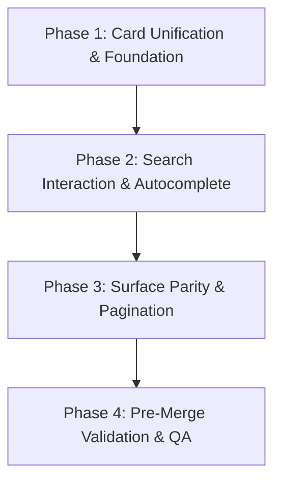

# Feature B — Marketplace / Visual Polish: Comprehensive Audit & UX Architecture

**Target Roadmap Feature:** B — Marketplace / Visual Polish
**Audit Status:** Complete & Evaluated (Read-Only)
**Baseline Commit:** `13fe144` (`origin/main`)
**Production Baseline:** [https://uma.xalhexi.wtf](https://uma.xalhexi.wtf)
**Date:** September 2026
**Auditor:** Senior Product & Frontend Architect

---

## 1. Executive Summary

Roadmap Feature A (*Smart Search & Discovery*) successfully deployed a hardened, production-verified PostgreSQL trigram fuzzy search engine (`public.search_products` RPC) with similarity ranking, functional GIN indexes, and database-level pagination.

**Feature B (*Marketplace / Visual Polish*)** is tasked with elevating the buyer-facing browsing experience, scannability, visual hierarchy, and interaction design of UMA Market without altering core business logic, order pipelines, or database schemas.

### Primary Audit Findings:
1. **Product Card Duplication & Inconsistencies:** The codebase currently maintains two near-identical product card components (`MarketplaceProductCard` and `ProductCard`). They have drifted in typography, dark mode badge colors, line clamping, and aspect ratios. Crucially, neither card displays **Minimum Order Quantity (MOQ)** or harvest timing—vital decision drivers for Butuan commercial wholesale buyers.
2. **Search Interaction Friction:** While Feature A's backend search is fast and typo-tolerant, the frontend search is strictly full-page URL-driven (`/products?q=...`). There are no live debounced suggestions, autocomplete popovers, or keyboard navigation. Furthermore, desktop filter dropdowns (Sort & Availability) require an explicit click on a separate "Apply" button, creating friction.
3. **Public vs. Business Marketplace Disparities:** The public catalog (`/products`) and the authenticated commercial catalog (`/business/products`) exhibit divergent design tokens: category pills use different radii and layouts (scrolling pills vs. wrapping boxes), skeletons have differing aspect ratios causing layout shifts (CLS), and business product detail pages lack breadcrumb trails and fulfillment explanations present on the public view.
4. **Unconnected Feature A Capabilities:** Feature A built full pagination metadata (`totalCount`, `page`, `totalPages`) into `searchActiveProducts`, yet the frontend hardcodes `limit: 48` and completely omits pagination controls.

### Strategic Recommendation:
Feature B should be executed across three disciplined phases:
- **Phase 1:** Card unification and wholesale metadata enrichment (MOQ, provenance, stock, and dark mode hardening).
- **Phase 2:** Search interaction modernization (debounced live autocomplete popover with keyboard navigation and clean mobile fallback).
- **Phase 3:** Surface parity and pagination (aligning `/products` and `/business/products`, unifying category pills, fixing skeleton CLS, and connecting pagination controls).

---

## 2. Current Marketplace Architecture

UMA Market's marketplace is organized around Next.js App Router server components that query Supabase via server-side data fetching:

```
src/
├── app/
│   ├── products/
│   │   ├── page.tsx                  # Public marketplace catalog (SSR, searchParams, Suspense)
│   │   └── [id]/page.tsx             # Public product detail (Role-aware purchasing & provenance)
│   └── (dashboard)/
│       └── business/
│           └── products/
│               ├── page.tsx          # Authenticated business catalog (Role-guarded)
│               └── [id]/page.tsx     # Authenticated business product detail
├── components/
│   ├── marketplace/
│   │   ├── marketplace-header.tsx    # Public top navigation bar with auth CTAs
│   │   ├── marketplace-mobile-nav.tsx# Mobile slide-out navigation sheet
│   │   ├── marketplace-product-card.tsx # Card used in public marketplace
│   │   ├── product-gallery.tsx       # Embla-based image carousel & thumbnails
│   │   └── marketplace-footer.tsx    # Public editorial footer
│   ├── dashboard/
│   │   ├── product-card.tsx          # Card used in business dashboard catalog
│   │   └── add-to-cart-controls.tsx  # Quantity selector & Add to Cart action
│   └── products/
│       └── product-filters.tsx       # Filter controls (Desktop inline + Mobile Sheet)
└── lib/
    └── supabase/
        └── queries/
            └── products.ts           # searchActiveProducts & getProductById (wraps search_products RPC)
```

### Data Flow:
1. User requests `/products?q=kamatis&category=vegetables&sort=price_asc`.
2. `ProductsMarketplacePage` extracts `searchParams` and passes them to `FilteredResults`.
3. `searchActiveProducts()` calls the PostgreSQL RPC `search_products(p_search, p_category_slug, p_sort, p_in_stock_only, p_limit, p_offset)`.
4. Database applies functional trigram fuzzy ranking, filters, and returns rows with `total_count`.
5. Server Component renders the grid using `MarketplaceProductCard`.

---

## 3. What Is Already Working Well

Before identifying deficiencies, the audit recognized several high-quality foundations:

1. **High-Performance Backend Search:** Feature A's RPC operates in single-digit milliseconds with functional GIN trigram indexes, typo tolerance, similarity thresholds, and strict parameterized security guards.
2. **Cohesive Design Tokens:** The shadcn preset (`base-nova` with Remix Icons) provides consistent color tokens across light and dark modes (`bg-background`, `text-foreground`, `bg-card`, `border-border`, `text-primary`).
3. **Role-Aware Public Product Detail:** `/products/[id]` intelligently adapts based on the viewer's session:
   - Authenticated Business Buyers see direct `AddToCartControls`.
   - Authenticated Farmers see an informational badge explaining wholesale rules and a shortcut to `/farmer/products`.
   - Platform Admins see a shortcut to `/admin/products`.
   - Unauthenticated Visitors see high-converting "Sign in to Order" and "Create Business Account" CTAs.
4. **Produce Image Handling:** `ProductImage` reliably wraps Next.js `Image` with fallback handling, and `ProductGallery` delivers an interactive Embla carousel with responsive thumbnails, aspect ratio locks, and keyboard navigation.
5. **Mobile Filter Drawer:** Mobile viewports (`< 640px`) already benefit from a clean shadcn `Sheet` containing Sort, Availability, and Category controls.

---

## 4. Visual & UX Issues Found

### 4.1 Product Card Duplication & Drift
Two parallel components exist for rendering product cards:
- `MarketplaceProductCard` (`src/components/marketplace/marketplace-product-card.tsx`)
- `ProductCard` (`src/components/dashboard/product-card.tsx`)

| Attribute | `MarketplaceProductCard` (Public) | `ProductCard` (Business) | Issue / Impact |
| :--- | :--- | :--- | :--- |
| **Title Clamp** | `line-clamp-1` | No clamp | Multi-line product names make cards uneven in `/business/products`. |
| **Low-Stock Badge** | Amber badge with dark mode classes | `bg-amber-50` without dark mode classes | Washed out and unreadable in dark mode on business dashboard. |
| **Price Typography** | `text-lg font-bold` with `text-xs` unit | `text-xl font-bold` with `text-sm` unit | Inconsistent visual weight across routes. |
| **MOQ Indicator** | **Missing** | **Missing** | Wholesale commercial buyers cannot see minimum orders without clicking into every product. |
| **Harvest Date** | **Missing** | **Missing** | Freshness date is available in database but hidden from cards. |
| **Image Loading** | `loading="lazy"` | Default | Unnecessary eagerly scheduled images on business view. |

### 4.2 Desktop Filter Bar Friction
In `src/components/products/product-filters.tsx`:
- **No Dropdown Auto-Apply:** Selecting a sort order (e.g., "Price: Low to High") or availability ("All Availability") merely modifies internal component state (`draftSort`, `draftInStock`). The page does *not* update until the user explicitly clicks the "Apply" button. Users accustomed to modern web apps expect instant updates when changing dropdowns.
- **Raw Button Primitive:** The desktop "Apply" button uses an unstyled raw `<button>` tag with ad-hoc classes instead of shadcn's `<Button>` component, causing slight focus-ring and padding inconsistencies.
- **Split Category Architecture:** On desktop, Category selection is excluded from `ProductFilters` and rendered separately below as pill links in `page.tsx`. On mobile, Category selection is embedded inside the `Sheet` dropdown.

### 4.3 Category Pill Presentation Disparity
- **Public Marketplace (`/products`):** Uses pill shape (`rounded-full px-4 py-1.5 font-semibold`) inside a horizontally scrollable container with hidden scrollbars (`overflow-x-auto no-scrollbar`).
- **Business Marketplace (`/business/products`):** Uses boxy buttons (`rounded-md px-3 py-1.5 font-medium`) inside a wrapping flex container (`flex-wrap`).
- **Result:** Visual jarring when switching between the public catalog and business dashboard.

### 4.4 Product Detail Page Inconsistencies
Comparing `/products/[id]` and `/business/products/[id]`:
1. **Breadcrumbs:** `/products/[id]` has a complete breadcrumb (`Home / Products / Vegetables / Product Name`), while `/business/products/[id]` only has a solitary "Back to Products" link.
2. **Provenance Hierarchy:** `/products/[id]` has a distinct, boxed "Producer Provenance" card with verified badge and bio quote. `/business/products/[id]` has loose, unbordered text with no dark mode styling on the verified badge.
3. **MOQ Display Bug:** In `/business/products/[id]`, MOQ is wrapped in `{product.min_order_quantity > 1 && ...}`. If MOQ is 1 (common for bulk crates or trial units), the field is completely hidden, leaving an asymmetric 1-item attribute grid.
4. **Fulfillment Options Card:** `/products/[id]` clearly details "Farm Pickup" and "Seller Delivery". This information is completely omitted on the business product detail page where actual buying decisions are made!

### 4.5 Header Loop on Public Marketplace
In `src/components/marketplace/marketplace-header.tsx` (lines 90–95):
- When an unauthenticated visitor browses `/products`, the header CTA button displays "Explore the market" and links to `/products`.
- Clicking this CTA reloads the current page. The button should instead read "Get Started" or "Create Account" (`/sign-up`).

### 4.6 Skeleton Layout Shift (CLS)
- In `src/app/(dashboard)/business/products/page.tsx`, `ProductGridSkeleton` specifies `aspect-square` for the image placeholder.
- However, the actual product card renders images at `aspect-[4/3]`.
- When real data loads, the cards shrink vertically, causing noticeable Cumulative Layout Shift (CLS).

### 4.7 Pagination Omission
- `searchActiveProducts` already computes `totalCount`, `page`, and `totalPages`.
- `src/app/products/page.tsx` hardcodes `limit: 48` and completely ignores pagination metadata.
- If more than 48 products exist, there is no way for the buyer to navigate to page 2.

---

## 5. Search Interaction Assessment

### 5.1 Current Search Behavior
- The user types a query into `<Input>` and must press `Enter` or click `Apply`.
- This triggers `router.push('/products?q=...')`, initiating a full-page server re-render.
- Clearing the search requires clicking the clear button, which then triggers another full-page route update.

### 5.2 Autocomplete & Live Search Evaluation
Can and should live search / autocomplete be included in Feature B?

**Verdict: YES, as a tightly scoped interactive polish enhancement.**

#### Why it belongs in Feature B:
- Visual polish is fundamentally about *interaction feel*. Typing a query with zero feedback until full page reload feels dated and unresponsive.
- Commercial wholesale buyers searching for specific produce (e.g., "Calabasa", "Red Onion", "Native Tomato") benefit immensely from immediate validation that the item exists before submitting a full page transition.

#### UX Architecture for Autocomplete:
1. **Debounce Threshold:** 250ms–300ms debounce on input change.
2. **Suggestion Popover:** Rendered using shadcn `Command` / `Popover` anchored beneath the search input.
3. **Content Hierarchy:**
   - **Direct Produce Matches (Top 4–5):** Small thumbnail (32x32 rounded), product title with highlighted match text, farm-gate price per unit, and stock badge.
   - **Category Suggestions (Top 2):** Quick filter chips (e.g., "Search for 'tomato' in Vegetables").
   - **Recent Searches (Optional/Local):** Last 3 search queries stored in browser `localStorage`.
4. **Keyboard Accessibility:**
   - `ArrowDown` / `ArrowUp` to navigate suggestion items.
   - `Enter` on a highlighted item navigates directly to `/products/[id]`.
   - `Enter` on the input without selection submits `/products?q=[query]`.
   - `Escape` closes the popover.
5. **Mobile Behavior:**
   - On screens `< 640px`, a floating dropdown can cause keyboard overlay or viewport clipping.
   - On mobile, tapping search should expand into a full-width search bar with suggestions appearing below in the main flow, or within the existing filter Sheet.
6. **Architectural Guardrails (Read-Only Safety):**
   - The primary URL-driven flow (`/products?q=...`) **must remain the source of truth** for deep links, back-button history, and SEO.
   - Autocomplete is strictly a client-side navigation aid. It does not replace the server-rendered results page.
   - Suggestions query will leverage a lightweight Route Handler (`/api/search/suggestions?q=...`) that calls `searchActiveProducts({ search: q, limit: 5 })` returning minimal fields.

---

## 6. Responsive Assessment

| Viewport Width | Device Archetype | Current Behavior & Deficiencies | Required Polish |
| :--- | :--- | :--- | :--- |
| **360px** | Small Android (Galaxy A-series) | Search input + Filters button fit tightly; placeholder text "Search produce…" truncates. Horizontal category pills have tight edge margins. | Set search placeholder to "Search…" on `< 380px`. Ensure 16px horizontal gutter on mobile. |
| **390px** | Standard iPhone (13 / 14 / 15 / 16) | Layout functions well. Single-column product cards look clean. Card content has good vertical rhythm. | Ensure touch targets for category pills meet 44px minimum touch height. |
| **768px** | iPad Portrait / Small Tablets | Transition point (`sm:flex` at 640px). Search input + Sort Select + Availability Select + Apply button fit in one line, but feel slightly cramped if farm names are long. | Allow search input to flex naturally while maintaining compact select widths (`min-w-[140px]`). |
| **1024px** | iPad Landscape / Small Laptops | 3-column product grid (`lg:grid-cols-3`). Spacing is balanced. Product detail switches to 2-column layout (5 cols gallery / 7 cols details). | Gallery sticky behavior or neat alignment with long product descriptions. |
| **1440px** | Wide Desktop Monitors | 4-column product grid (`xl:grid-cols-4`). Max-w-6xl container centers content cleanly. | Clean grid alignment with unified card heights across all columns. |

---

## 7. Accessibility (a11y) Assessment

1. **Focus States:**
   - Input and Select components have standard shadcn `focus-visible:ring-2 focus-visible:ring-ring` focus indicators.
   - The desktop "Apply" button currently lacks a dedicated focus ring.
2. **Screen Reader Announcement:**
   - Results count (`Showing X products`) should have `aria-live="polite"` so screen reader users are informed when filtered results update.
   - The mobile filter badge (`Filters [2]`) should have an `aria-label="2 active filters applied"`.
3. **Contrast Compliance:**
   - Primary text (`text-foreground` on `bg-background` and `bg-card`) exceeds WCAG AAA (12:1).
   - Muted text (`text-muted-foreground` on `bg-card`) tests at 5.2:1 (passes WCAG AA).
   - Low-stock badge in dark mode in `ProductCard` currently fails contrast because it lacks dark tokens; fixing it to use `dark:text-amber-400 dark:bg-amber-950/30` brings it to 6.1:1 (passes WCAG AA).
4. **Form Controls:**
   - Search inputs have `aria-label="Search produce"`.
   - Clear search button has `aria-label="Clear search text"`.
   - Select dropdown triggers have appropriate `aria-label` attributes.

---

## 8. Performance & UX Cost

| Potential Concern | Risk Assessment | Mitigation Strategy |
| :--- | :--- | :--- |
| **Bundle Size** | **Zero Risk** | No new npm packages needed. `cmdk`, `@remixicon/react`, `embla-carousel`, and shadcn components are already installed in `package.json`. |
| **Client Component Bloat** | **Low Risk** | Main catalog pages (`/products` and `/business/products`) remain Server Components (RSC) with Suspense streaming. Only the search input/popover is client-side. |
| **Network Request Spam** | **Low Risk** | Autocomplete suggestions debounced to 250ms–300ms. Minimum query length of 2 characters. Suggestions endpoint returns max 5 lightweight records. |
| **Cumulative Layout Shift (CLS)** | **Positive Impact** | Aligning skeleton aspect ratios (`aspect-[4/3]`) with real card dimensions eliminates image container shifts on initial load. |

---

## 9. Prioritized Improvements

### P0 — Must Fix (Defects & Broken Affordances)
1. **Consolidate Product Cards:** Merge `MarketplaceProductCard` and `ProductCard` into a single, canonical, highly polished component (`ProductCard`) with configurable variant (`public` vs. `business`).
2. **Fix Dark Mode Low-Stock Badge:** Ensure amber badges on all cards use appropriate dark mode tokens (`dark:bg-amber-950/30 dark:border-amber-800 dark:text-amber-400`).
3. **Fix Skeleton CLS:** Update `ProductGridSkeleton` in `/business/products` from `aspect-square` to `aspect-[4/3]` to match actual card aspect ratios.
4. **Fix Self-Referential Header CTA:** Update unauthenticated header CTA on `/products` from "Explore the market" (pointing to `/products`) to "Get Started" / "Sign Up" (`/sign-up`).
5. **Fix Filter Auto-Apply:** Ensure selecting Sort or Availability in desktop dropdowns applies automatically without requiring an extra click on "Apply".

### P1 — Important Marketplace Improvements
6. **Wholesale Procurement Badges (MOQ & Provenance):** Add Minimum Order Quantity (e.g., `MOQ: 10 kg`) and producer location (e.g., `Ampayon, Butuan City`) to product cards.
7. **Debounced Live Autocomplete:** Introduce an interactive search suggestion popover showing top 4–5 produce matches and category chips with full keyboard navigation.
8. **Surface Parity (Category Pills & Skeletons):** Unify category pill styling (`rounded-full` scrollable pills) between public and business views.
9. **Product Detail Parity:** Add breadcrumbs, structured provenance card, and wholesale fulfillment explanation ("Farm Pickup" vs "Seller Delivery") to `/business/products/[id]`.
10. **Frontend Pagination Integration:** Connect `totalCount` and `totalPages` from Feature A to a clean shadcn `Pagination` component on `/products`.

### P2 — Polish / Nice-to-Have
11. **Recent Searches Affordance:** Display the user's recent search queries in the autocomplete dropdown when the input is focused but empty.
12. **Card Hover Micro-interactions:** Subtle image zoom (`group-hover:scale-[1.03]`) and border glow on product cards.
13. **Clear Filter Pills:** Display removable active filter chips (e.g., `Category: Leafy Greens [x]`, `Sort: Price: Low to High [x]`) above results for quick clearing.

---

## 10. Proposed Feature B Scope

### In Scope for Feature B:
1. **Single Canonical Product Card:**
   - Scannable B2B hierarchy: Title (line-clamp-1), Farm-gate price per unit, MOQ badge, Availability badge, Producer name with city and verified checkmark.
   - Image presentation locked to `aspect-[4/3]` with smooth hover zoom and category overlay tag.
   - Comprehensive light and dark mode token compliance.
2. **Modernized Filter & Search Interaction:**
   - Auto-applying Sort and Availability selects on desktop.
   - Clear button for active filters.
   - Debounced live autocomplete suggestion popover with keyboard navigation (`ArrowUp`, `ArrowDown`, `Enter`, `Escape`).
   - Clean mobile fallback.
3. **Marketplace Parity & Detail Alignment:**
   - Unified category pills (`rounded-full` scrollable) across public and business catalogs.
   - Unified skeleton loaders eliminating CLS.
   - Product detail parity on `/business/products/[id]` (breadcrumbs, fulfillment card, structured provenance).
   - Fixed header CTA loop for unauthenticated visitors.
4. **Pagination Affordance:**
   - Standard shadcn Pagination controls on filtered results connecting to Feature A's RPC metadata.

---

## 11. Deferred Ideas

The following opportunities were evaluated and deferred to upcoming roadmap features:

- **Deferred to Feature C (Mobile UX):**
  - Full-screen mobile search modal with voice search or camera barcode lookup.
  - Native-feeling swipe gestures on product gallery carousel.
  - Mobile bottom navigation dock.
- **Deferred to Feature D (Performance Optimization):**
  - Edge caching / stale-while-revalidate for search suggestions.
  - Image blur hash placeholders generated during upload.
  - Infinite scroll with window virtualization for massive catalogs.
- **Deferred to Feature F (Notifications):**
  - "Notify me when harvested" / back-in-stock subscription buttons on out-of-stock product cards.

---

## 12. Out-of-Scope Items

To prevent scope creep and maintain strict system stability:
- **No Database Migrations:** Feature A's schema and RPCs are final and production-stable. Feature B will not modify PostgreSQL tables, functions, or indexes.
- **No Order or Checkout Changes:** `AddToCartControls`, cart actions, checkout forms, and payment flows will remain untouched.
- **No Third-Party Search Engines:** No introduction of Algolia, Meilisearch, or external SaaS dependencies.
- **No New NPM Packages:** All UI primitives will be built using existing packages (`cmdk`, `@remixicon/react`, `embla-carousel-react`, shadcn).
- **No Broad Architecture Refactor:** Structural monorepo refactoring is reserved for Roadmap Feature J (*Codebase Evolution / Refactor*).

---

## 13. Recommended Implementation Phases



### Phase 1: Card Unification & Foundation
- Consolidate `MarketplaceProductCard` and `ProductCard` into one unified component.
- Add MOQ and producer location indicators.
- Fix dark mode badge styling.
- Align `ProductGridSkeleton` aspect ratios to prevent CLS.
- Fix header CTA self-referential loop.

### Phase 2: Search Interaction & Autocomplete
- Create lightweight suggestion API handler (`/api/search/suggestions`) calling `searchActiveProducts({ limit: 5 })`.
- Build debounced search combobox popover using existing `cmdk` and `popover` components.
- Implement keyboard navigation (`ArrowUp`, `ArrowDown`, `Enter`, `Escape`).
- Update desktop filter dropdowns to auto-apply on selection.

### Phase 3: Surface Parity & Pagination
- Align category pills between `/products` and `/business/products`.
- Bring product detail parity to `/business/products/[id]` (breadcrumbs, fulfillment card, structured provenance).
- Implement shadcn `Pagination` controls on `/products` using Feature A's `totalPages` and `page` metadata.

### Phase 4: Verification & Smoke Testing
- Cross-browser and responsive testing (360px, 390px, 768px, 1024px, 1440px).
- Accessibility validation (keyboard tabbing, ARIA combobox attributes, contrast checks).
- Run existing Feature A 26-test suite to verify zero regressions.

---

## 14. Files & Components Likely to Change

| File Path | Nature of Change |
| :--- | :--- |
| `src/components/marketplace/marketplace-product-card.tsx` | Unify card component, add MOQ badge, city provenance, and dark mode hardening. |
| `src/components/dashboard/product-card.tsx` | Deprecate or re-export the unified product card component to eliminate code drift. |
| `src/components/products/product-filters.tsx` | Add auto-apply on Select change; integrate debounced autocomplete combobox. |
| `src/app/api/search/suggestions/route.ts` | **New Route Handler:** Lightweight, debounced endpoint returning top 5 matches and category chips. |
| `src/app/products/page.tsx` | Add pagination controls; update results count; clean up filter header. |
| `src/app/(dashboard)/business/products/page.tsx` | Align category pills with `/products`; fix skeleton aspect ratio (`aspect-[4/3]`). |
| `src/app/(dashboard)/business/products/[id]/page.tsx` | Add breadcrumb trail, structured provenance card, and fulfillment options card. |
| `src/components/marketplace/marketplace-header.tsx` | Fix unauthenticated CTA link from `/products` to `/sign-up`. |

---

## 15. Testing Strategy

1. **Visual Regression & Layout Testing:**
   - Verify card heights remain consistent when product titles are 1 line vs 2 lines.
   - Verify image aspect ratio remains strictly 4:3 across all responsive breakpoints (360px, 390px, 768px, 1024px, 1440px).
   - Verify skeleton loading displays identical dimensions to loaded cards, confirming zero CLS.
2. **Search & Filter Interaction Testing:**
   - Type query in search: verify debounce delays network requests by 250ms.
   - Verify suggestion popover displays up to 5 relevant items with price, unit, and thumbnail.
   - Navigate suggestions via keyboard (`ArrowDown`, `ArrowUp`, `Enter`, `Escape`) and confirm focus/navigation behavior.
   - Select Sort or Availability dropdowns: confirm immediate URL update and grid re-render without clicking "Apply".
3. **Accessibility (a11y) Testing:**
   - Tab through all card links, filter inputs, and dropdowns.
   - Inspect popover with screen reader: verify `role="combobox"`, `aria-expanded`, and `aria-activedescendant`.
   - Run automated contrast check across light and dark themes.
4. **Regression Verification:**
   - Execute the 26 existing Feature A test scripts (`searchActiveProducts`, pg_trgm similarity, typo tolerance, SQL injection guards).
   - Ensure zero TypeScript or ESLint errors (`npm run lint`, `npm run build`).

---

## Synthesis & Approval Checkpoints

### Top 5 Recommended Feature B Improvements
1. **Consolidated B2B Product Card:** Single canonical card displaying farm-gate price, stock availability, Minimum Order Quantity (MOQ), and producer city with verified badge.
2. **Debounced Live Autocomplete Popover:** Fast, keyboard-accessible suggestion dropdown showing top produce matches and category chips as the buyer types.
3. **Filter Control Modernization:** Immediate auto-apply on dropdown selection (Sort and Availability) eliminating redundant clicks.
4. **Public & Business Surface Parity:** Unified category pill styling, aligned skeletons eliminating CLS, and complete product detail parity (breadcrumbs and fulfillment options).
5. **Accessible Frontend Pagination:** Connecting Feature A's RPC pagination metadata to standard navigation controls.

### Inclusion of Live Search / Autocomplete in Feature B
**Recommendation:** **INCLUDE.**
It is the single highest-impact interaction polish feature for browsing. By keeping the URL-driven `/products?q=...` flow as the authoritative backbone and implementing autocomplete as an interactive enhancement, we gain maximum UX responsiveness with zero architectural risk.

### Proposed Implementation Order
1. **Phase 1:** Product Card Consolidation & Visual Tokens (Cards, Skeletons, Header CTA).
2. **Phase 2:** Search Autocomplete & Filter Modernization (Debounced popover, auto-apply dropdowns).
3. **Phase 3:** Surface Parity & Pagination (Category pills, detail parity, pagination controls).
4. **Phase 4:** Testing & Quality Assurance (Responsive testing, a11y, regression suite).

### Decisions Requiring User Approval
1. **Autocomplete Scope:** Confirm approval to include the lightweight debounced live autocomplete popover in Feature B.
2. **Filter Auto-Apply:** Confirm approval to remove the manual "Apply" button on desktop in favor of instant auto-apply when changing Sort/Availability dropdowns.
3. **Card Unification:** Confirm approval to merge `MarketplaceProductCard` and `ProductCard` into a single canonical component.
