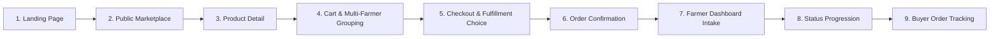

# UMA Market — Presentation Script

**Project:** UMA Market (Localized B2B Agricultural Procurement Platform)  
**Target Audience:** Capstone / Thesis Evaluation Panel  
**Estimated Duration:** 7–10 Minutes  
**Live Production URL:** [https://uma.xalhexi.wtf](https://uma.xalhexi.wtf)  
**Localhost Environment:** `http://localhost:3000`  
**Git Baseline:** `v0.1.0-pilot` (`main`)

---

## 1. Presentation Objective

This demonstration proves that **UMA Market** successfully digitizes direct agricultural trade between local Butuan farmers and commercial food buyers through an authenticated, atomic procurement workflow that enforces minimum order quantities, transparent farm-gate pricing, multi-farmer order decomposition, and auditable fulfillment tracking without intermediary markup.

---

## 2. Opening — The Problem

### Spoken Opening (Presenter)
> "Good morning, members of the panel. 
> 
> In Butuan City and the broader Caraga region, commercial food establishments—such as restaurants, canteens, catering commissaries, and grocers—face daily friction in sourcing fresh, high-volume produce. They typically rely either on informal roadside networks, middleman markups at wet markets, or fragmented text messaging with individual growers.
> 
> For smallholder farmers and cooperatives, marketing their harvest directly to institutional buyers is equally challenging. They lack a structured channel to showcase live harvest volumes, enforce wholesale minimum order quantities, or coordinate scheduled pickups and deliveries.
> 
> **UMA Market** addresses this disconnect. It is a localized B2B agricultural procurement platform that connects verified local producers directly with commercial food businesses. Today, I will walk you through our end-to-end procurement cycle: from produce discovery and wholesale cart placement, through atomic order dispatch, producer fulfillment progression, and order fulfillment tracking."

---

## 3. Recommended Demo Sequence

The presentation follows the natural **Discover → Decide → Order → Fulfill → Track** commercial lifecycle:

1. **Landing Page** (`/`): Core value proposition, localized branding, verified trust cues.
2. **Public Marketplace** (`/products`): Live harvest catalog, category filtering, search, and producer provenance.
3. **Product Detail** (`/products/03f88c0d-30c2-4be8-b45b-22c545fecf07`): Transparent farm-gate pricing, MOQ enforcement, producer verification badge.
4. **Wholesale Cart** (`/business/cart`): Quantity validation, farm-grouped itemization.
5. **Checkout Workflow** (`/business/checkout`): Selection between *Seller Delivery* and *Farm Pickup*, direct settlement terms.
6. **Order Confirmation** (`/business/checkout/confirmation/[orderId]`): Order snapshot generation, atomic stock decrement.
7. **Farmer Incoming Orders** (`/farmer/orders`): Role-separated dashboard, incoming order intake.
8. **Farmer Fulfillment Actions** (`/farmer/orders/[id]`): Structured state-machine transitions (*Accept → Preparing → Out for Delivery → Completed*).
9. **Buyer Order Tracking** (`/business/orders/[id]`): Multi-milestone progress timeline, counterparty communication.

---

## 4. Detailed Presenter Script

---

### Step 1: Landing Page & Localized Context

* **SHOW:** Open browser to [`/`](http://localhost:3000/).
* **ROUTE:** `/`
* **POINT OUT:**
  * Clean, restrained branding: *"Fresh Local Produce, Direct from Butuan Growers to Commercial Kitchens."*
  * Localization badge: *Butuan City, Agusan del Norte*.
  * Role separation cues: Clear entry points for commercial buyers and local producers.
  * *Fresh on UMA* product rail showcasing real crop availability.
* **SAY:**
  > "We begin on the UMA Market landing page. The platform is designed specifically for Butuan City's local agricultural trade. Rather than operating as an anonymous e-commerce store, UMA emphasizes producer identity, wholesale volumes, and zero-commission direct trade between local farms and commercial establishments."
* **EXPECTED RESULT:** The landing page renders smoothly with the *Fresh on UMA* produce rail and top navigation bar.

---

### Step 2: Public Marketplace Discovery & Filtering

* **SHOW:** Click **"Explore Produce"** or **"Market"** in the top navigation.
* **ROUTE:** `/products`
* **POINT OUT:**
  * Fast category pills across 8 agricultural categories: *Vegetables, Fruits, Rice & Grains, Root Crops, Herbs & Spices, Poultry & Eggs, Fish & Seafood, Other*.
  * Click the **Vegetables** category pill.
  * Search bar with live URL parameter synchronization (`?category=vegetables`).
  * Producer identity on each product card: Farm business name, location, and the green **✓ Verified Producer** trust badge.
* **SAY:**
  > "Moving into the public marketplace, commercial buyers can browse live harvest catalogs without authentication barriers. Buyers can filter by category or search by crop name. Notice that each listing explicitly identifies the grower and displays their verified status."
* **EXPECTED RESULT:** The catalog filters instantly to vegetable listings, displaying *Ampayon Fresh Red Tomatoes* by *Green Valley Organic Farm*.

---

### Step 3: Product Detail, Farm-Gate Pricing & MOQ Enforcement

* **SHOW:** Click the product card for **"Ampayon Fresh Red Tomatoes"**.
* **ROUTE:** `/products/03f88c0d-30c2-4be8-b45b-22c545fecf07`
* **POINT OUT:**
  * Farm-gate price: `₱65.00 / kg`.
  * Real-time available volume: `200 kg in stock`.
  * Minimum Order Quantity (MOQ): `Min. order: 2 kg`.
  * Quantity selector initialized to `2 kg` (preventing sub-MOQ orders).
  * Producer provenance panel: *Green Valley Organic Farm*, located in Ampayon, Butuan City, with the **✓ Verified Producer** badge.
* **SAY:**
  > "On the product detail page, buyers inspect critical B2B terms before purchasing. UMA enforces a Minimum Order Quantity—here set to 2 kilograms—ensuring that transactions remain commercially viable for the grower. Notice the initial quantity selector respects this threshold, calculating the total at ₱130."
* **EXPECTED RESULT:** The page displays full harvest specifications, high-resolution produce photography, and an initialized total of `₱130.00`.

---

### Step 4: Add to Cart & Buyer Authentication

* **SHOW:** Click **"Add to Cart"** → Sign in as `buyer.test@example.com` → Open the Cart at `/business/cart`.
* **ROUTE:** `/business/cart`
* **POINT OUT:**
  * Authenticated buyer profile: *Maria Santos / Balanghai Bistro*.
  * Cart groupings: Products are automatically grouped by fulfilling farm (*Green Valley Organic Farm*).
  * Quantity steppers allowing dynamic batch adjustments.
  * Subtotal summary: `2 kg × ₱65.00 = ₱130.00`.
* **SAY:**
  > "When the buyer adds the produce to their cart and signs in, UMA recognizes their commercial profile—Maria Santos representing Balanghai Bistro. Because wholesale buyers often procure from multiple growers, our cart architecture groups line items by fulfilling farm to prepare for independent order dispatch."
* **EXPECTED RESULT:** The cart displays 1 item grouped under *Green Valley Organic Farm* with a `₱130.00` subtotal and an active "Proceed to Checkout" button.

---

### Step 5: Checkout Workflow & Fulfillment Choice

* **SHOW:** Click **"Proceed to Checkout"**.
* **ROUTE:** `/business/checkout`
* **POINT OUT:**
  * Fulfillment selection cards:
    * **Seller Delivery**: Producer handles transport to the buyer's establishment.
    * **Farm Pickup**: Buyer arranges collection at the farm gate.
  * Select **Seller Delivery**: Observe the pre-populated registered commercial address for *Balanghai Bistro* in Butuan City.
  * Order notes textarea: enter a delivery note (e.g., *"Please deliver before 10:00 AM for morning prep"*).
  * Transparent financial settlement disclosure: Direct payment via Cash on Delivery (COD) / Bank Transfer upon delivery.
* **SAY:**
  > "In the checkout workflow, the buyer selects their fulfillment method. We choose Seller Delivery, which automatically pulls the registered establishment address. UMA is deliberate about payment: in this pilot version, payment is settled directly between counterparties upon fulfillment, avoiding unnecessary financial intermediary fees."
* **EXPECTED RESULT:** The form validates the fulfillment selection and commercial delivery address cleanly.

---

### Step 6: Atomic Order Placement & Confirmation

* **SHOW:** Click **"Place Order"**.
* **ROUTE:** `/business/checkout/confirmation/[orderId]`
* **POINT OUT:**
  * Green confirmation badge: *"Order Placed Successfully!"*
  * Unique Order Reference: `#...`
  * Snapshot pricing: Unit price (₱65.00), quantity (2 kg), and grand total (₱130.00) are immutably recorded in the database.
  * The shopping cart is atomically emptied upon database transaction commit.
* **SAY:**
  > "When the order is placed, an atomic PostgreSQL transaction executes. It decrements the grower's available inventory, creates the immutable order snapshot, and clears the buyer's cart. The buyer now receives an official order confirmation reference."
* **EXPECTED RESULT:** The confirmation screen renders with the exact order details, items snapshot, and a direct "Track Order" action.

---

### Step 7: Producer Intake in the Farmer Dashboard

* **SHOW:** Switch to the Farmer session (`farmer.test@example.com` — Juan Dela Cruz / *Green Valley Organic Farm*) → Navigate to `/farmer/orders`.
* **ROUTE:** `/farmer/orders`
* **POINT OUT:**
  * Clean role-separated Farmer dashboard navigation.
  * Status filter tabs: *All, Pending, Accepted, Preparing, Ready, Completed, Cancelled*.
  * The newly placed order appears at the top of the queue with a yellow **Pending** status badge.
  * Customer column: *Balanghai Bistro*. Total: `₱130.00`.
* **SAY:**
  > "Now, we switch roles to the producer, Juan Dela Cruz of Green Valley Organic Farm. In the Farmer Dashboard under Incoming Orders, the new purchase order immediately appears with a 'Pending' badge. The farmer sees the exact commercial customer and total value before committing harvest labor."
* **EXPECTED RESULT:** The incoming orders table displays the new order in `Pending` state.

---

### Step 8: Order Detail Inspection & Fulfillment Progression

* **SHOW:** Click the pending order row to open `/farmer/orders/[id]`.
* **ROUTE:** `/farmer/orders/[id]`
* **POINT OUT:**
  * Order Header: Reference `#ID`, placed timestamp, and current status badge.
  * Customer Card: *Balanghai Bistro*, contact phone number, and Butuan City delivery address.
  * Order items breakdown and delivery note (*"Please deliver before 10:00 AM..."*).
  * Built-in **Order Communications** chat for direct logistics coordination.
  * **Update Status Panel** displaying valid state-machine transition buttons.
* **SAY:**
  > "Opening the order detail, the farmer has complete operational visibility. The system provides integrated counterparty messaging for logistical coordination, and an enforced state-machine transition panel. Notice the grower can either Accept or Decline."
* **ACTION & TRANSITION DEMO:**
  1. Click **"Accept Order"** → Status transitions to **`Accepted`**.
  2. Click **"Mark as Preparing"** → Status transitions to **`Preparing`**.
  3. Click **"Out for Delivery"** → Status transitions to **`For Delivery`**.
  4. Click **"Mark as Delivered"** → Status reaches terminal milestone **`Completed`**.
* **SAY:**
  > "As the grower progresses through harvesting and packaging, each status click advances the order through strict database validation: Pending, Accepted, Preparing, Out for Delivery, and finally Completed."
* **EXPECTED RESULT:** Each button click triggers a Server Action with instantaneous UI revalidation; the order successfully reaches `Completed`.

---

### Step 9: Buyer Order Tracking & Auditable History

* **SHOW:** Switch back to the Buyer session (`buyer.test@example.com`) → Navigate to `/business/orders/[id]`.
* **ROUTE:** `/business/orders/[id]`
* **POINT OUT:**
  * Visual stepped order timeline (Horizontal on desktop, vertical on mobile).
  * Milestone circles: *Placed → Accepted → Preparing → For Delivery → Completed*.
  * Green checkmark icons indicating that every operational stage was completed.
  * Delivery address, contact information, and final itemized receipt.
* **SAY:**
  > "Finally, switching back to the commercial buyer's screen, Maria Santos views the order tracking timeline. All milestone circles are now green and checked. The buyer has complete transparency over the fulfillment history, confirming that the produce was harvested, dispatched, and delivered without ambiguity."
* **EXPECTED RESULT:** The timeline shows all completed stages with green checkmarks, matching the terminal status.

---

## 5. What UMA Demonstrates Technically

| Technical Capability | Implementation Evidence in Codebase |
| :--- | :--- |
| **Role-Based Access Control (RBAC)** | Clerk session claims (`user_role`) mapped to three strictly isolated routes: `/business/*`, `/farmer/*`, and `/admin/*`, with server-side middleware and layout guards. |
| **Row-Level Security (RLS)** | PostgreSQL policies enforce that buyers only access their own orders and cart items, while farmers only access orders and listings assigned to their `farmer_clerk_id`. |
| **Atomic Multi-Farmer Checkout** | PostgreSQL RPC (`place_checkout_orders`) wraps multi-farmer cart decomposition into an atomic transaction: validating stock, snapshotting prices, creating separate farm orders, and clearing the cart in a single commit. |
| **State-Machine Concurrency** | Order status progression is protected by database triggers and the `update_order_status` RPC. Invalid transitions (e.g. `completed → pending` or duplicate submissions) are rejected at the database engine level. |
| **Automatic Inventory Restitution** | Whenever an order is declined or cancelled, database triggers immediately restore reserved volumes back to the grower's active catalog stock. |
| **Real-Time Messaging** | Supabase Realtime WebSocket subscriptions over PostgreSQL changes with RLS security, enabling threaded counterparty coordination. |
| **SSR-Safe Token Integration** | Custom `useSupabase()` hook that injects freshly minted Clerk JWTs into the Supabase client while preventing execution during server-side pre-rendering passes. |

---

## 6. Panelist Attention Moments (Key Pauses)

Pause and emphasize these exact moments during the walkthrough:

1. **On the Product Detail Page:**
   > *"Notice the badge: '✓ Verified Producer'. This badge represents the producer's verified status in the platform and is controlled through the administrative workflow."*
2. **At Quantity Selection:**
   > *"Observe that the buyer cannot select 1 kilogram. The system enforces the grower's minimum order quantity of 2 kg, protecting smallholder farmers from unviable micro-orders."*
3. **During Multi-Farmer Cart Grouping:**
   > *"Even if a restaurant orders tomatoes from Ampayon and rice from Agusan Valley in one sitting, UMA decomposes the cart into independent contracts for each farm."*
4. **On the Status Transition Action:**
   > *"When the farmer clicks 'Accept Order', this transition is validated by a PostgreSQL state machine. The order cannot skip steps or be modified by unauthorized users."*
5. **On the Tracking Timeline:**
   > *"The buyer doesn't need to call or text the grower to ask for an update. The status timeline provides immediate, auditable commercial visibility."*

---

## 7. Things NOT to Demonstrate (Stay on the Golden Path)

To keep the presentation crisp and within the 10-minute window, **DO NOT** wander into:

* ❌ **User Onboarding / Role Selection (`/onboarding`):** Requires creating new Clerk accounts on the spot. Use the pre-seeded demo accounts.
* ❌ **Admin Dashboard Deep-Dives (`/admin/*`):** Mention that administrative oversight exists for grower verification and catalog moderation, but do not derail the core trade loop unless asked by panelists.
* ❌ **Profile Editing Screens (`/business/profile`, `/farmer/profile`):** Working, but secondary to the transaction narrative.
* ❌ **Simulating Broken Network / Edge Cases:** Do not intentionally input invalid quantities or trigger error dialogs unless specifically challenged during Q&A.
* ❌ **Unseeded Produce Items:** Stick to the golden demo product (*Ampayon Fresh Red Tomatoes*) to guarantee predictable pricing and stock.

---

## 8. Demo Failure & Recovery Plan

| Failure Scenario | Immediate Recovery Step |
| :--- | :--- |
| **Slow Page Load / Stalled Request** | Hard-refresh the page (`Ctrl + F5` or `Cmd + Shift + R`). The Next.js Turbopack development server will re-serve the Server Component. |
| **Clerk Device Verification Prompt** | If a login prompts for an email verification code, **do not panic**. Use the **1-Click Direct Login Links** pre-generated in `docs/demo/UMA-GOLDEN-DEMO.md` (or the presentation-day checklist) which bypass OTP instantly. |
| **Accidental Wrong Navigation** | Click the **"UMA Market"** logo in the top-left navigation to return immediately to `/`, or click the browser Back button. |
| **Order Status Button Doesn't Update** | Click refresh. If an action was already committed, the refreshed page will display the next valid milestone. Remember that the database rejects duplicate status submissions. |
| **Local Dev Server Stops** | Have a second terminal open or pre-test the live production URL at [https://uma.xalhexi.wtf](https://uma.xalhexi.wtf). Switch to the production tab if localhost fails. |

---

## 9. 60-Second Emergency Demo (Elevator Pitch Walkthrough)

If the panel requests a compressed 1-minute walkthrough:

1. **Second 0–15 (Marketplace & Product):**  
   Open [`/products`](http://localhost:3000/products), open **Ampayon Fresh Red Tomatoes**, point out `₱65/kg`, `MOQ: 2 kg`, and `✓ Verified Producer`.
2. **Second 16–30 (Cart & Checkout):**  
   Click Add to Cart → Proceed to Checkout → Select Seller Delivery → Click **Place Order**. Show confirmation screen.
3. **Second 31–45 (Farmer Action):**  
   Switch to Farmer tab → Open `/farmer/orders` → Open the new order → Click **Accept Order** → Click **Mark as Preparing**.
4. **Second 46–60 (Buyer Verification):**  
   Switch to Buyer tab → Open `/business/orders` → Show the live timeline transitioning to green active milestones. Conclude: *"Direct, transparent procurement in 4 clicks."*

---

## 10. Q&A Preparation for Panelists

### Product & Problem
* **Q: Why not just use existing e-commerce apps like Shopee or Facebook Marketplace?**  
  *Answer:* Generic e-commerce platforms cater to B2C retail with courier parcel delivery, retail fee structures, and non-perishable goods. Facebook Marketplace lacks structured inventory, minimum order enforcement, and status progression. UMA is specifically optimized for localized wholesale agricultural trade with farm-gate pricing, bulk MOQs, and direct counterparty delivery.

### Technical Architecture
* **Q: How are transactions kept secure across different roles?**  
  *Answer:* Security operates on defense-in-depth: Clerk issues cryptographically signed JWTs containing the user's role claim. Next.js middleware and route handlers guard dashboards server-side, while Supabase PostgreSQL Row-Level Security (RLS) policies evaluate `auth.jwt()->>'sub'` to ensure users can never read or write another participant's orders or cart items.

### Data & Concurrency
* **Q: What happens if two buyers try to buy the last 10 kg of tomatoes at the exact same second?**  
  *Answer:* Order placement is governed by an atomic PostgreSQL RPC (`place_checkout_orders`). The routine performs row-level locking on the product record, checks that `quantity_available >= requested_quantity`, decrements stock, and commits. The second transaction immediately receives a database-level rejection: *"Insufficient stock available"*.

### Business Logic & Payments
* **Q: Why doesn't UMA process credit card or GCash payments online right now?**  
  *Answer:* UMA does not process online card/GCash payments in the current pilot. Payment is settled directly between buyer and producer according to their agreed terms. Online payment integration is future work.

### Limitations & Future Work
* **Q: What is the next logical enhancement after this pilot phase?**  
  *Answer:* The natural next phase includes route optimization for cooperative aggregation trucks, seasonal harvest forecasting for advance pre-orders, and institutional invoicing exports for accounting systems.

---

## 11. Presentation-Day Checklist

Complete these checks **15 minutes before** entering the panel room:

- [ ] **Laptop Power:** Plugged into AC power, screen sleep disabled.
- [ ] **Network Connection:** Connected to stable Wi-Fi or mobile hotspot.
- [ ] **Local Server Running:** Terminal active with `npm run dev` (serving `http://localhost:3000`).
- [ ] **Production Backup Ready:** Browser tab open to [https://uma.xalhexi.wtf](https://uma.xalhexi.wtf).
- [ ] **Dual Browser Profiles Open:**
  - Window 1 (Left / Main): Logged in as **Buyer** (`buyer.test@example.com`).
  - Window 2 (Right / Incognito): Logged in as **Farmer** (`farmer.test@example.com`).
- [ ] **Demo Product Ready:** *Ampayon Fresh Red Tomatoes* verified active with MOQ = 2 kg and stock = 200 kg.
- [ ] **Clean Cart:** Buyer cart verified empty before starting.
- [ ] **Unnecessary Apps Closed:** Slack, messaging apps, and personal notifications silenced.
- [ ] **Screen Resolution:** Browser zoom set to 100% (or 110% if presenting on an external projector).

---

## 12. Final Presenter Notes

1. **Pace Yourself:** Speak deliberately. Do not rush through the workflow.
2. **Explain the "Why":** Focus on why a feature matters to a Butuan farmer or restaurant chef, not just which button you are clicking.
3. **Let Screens Breathe:** After clicking an action, pause 2 seconds to let the panelists see the toast notification and status badge change.
4. **Trust the System:** The core business logic, concurrency protections, and SSR-safe data integration have been hardened and verified end-to-end. Stay on the golden path and present with confidence.
