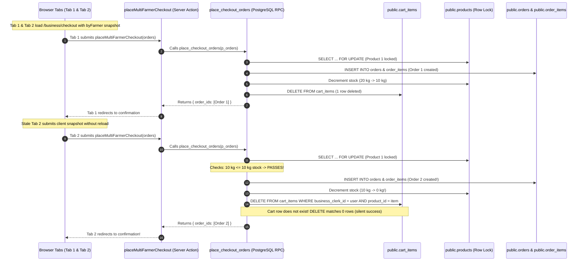
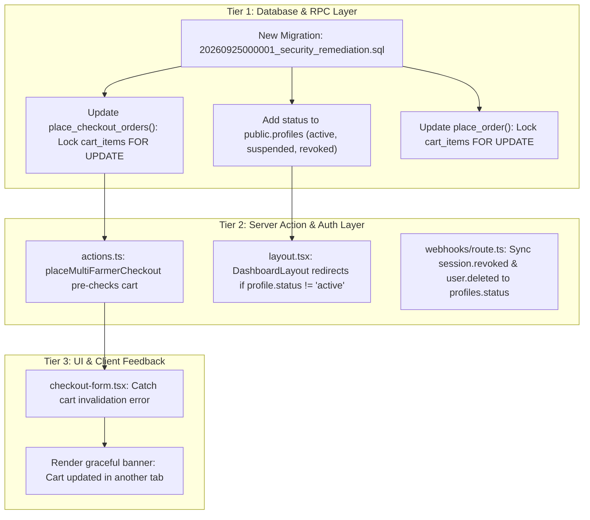

# UMA Market — Consolidated Security Findings Review & Remediation Plan

**Document Version:** 1.0.0  
**Audit Completion Date:** 2026-09-25  
**Target Environment:** Isolated Security-Test Environment (`http://localhost:3000`, Clerk Development, Supabase Ref `xckdihprwjdwutglytwu`)  
**Production Boundary:** `https://uma.xalhexi.wtf` (Supabase Ref `odnpkqjytrmciwmcehff`) — **100% Isolated & Untouched**  
**Branch:** `audit/security-resilience`  

---

## 1. Executive Summary & Audit Suite Overview

Between September 24 and September 25, 2026, UMA Market underwent a comprehensive, adversarial, multi-campaign security and resilience audit across six planned security vectors. Every campaign operated under strict ethical boundaries against a dedicated, isolated test infrastructure, utilizing authentic cryptographic credentials (Clerk RS256 JWTs), real Headed Puppeteer browser sessions with full cookie jars, high-concurrency Node.js worker threads, and the official Grafana k6 load engine.

### Campaign Accounting Summary

| Campaign ID | Focus Domain | Target Components | Execution Engine | Tests / Scenarios | PASS | FAIL | WARN | Confirmed Findings |
|---|---|---|---|:---:|:---:|:---:|:---:|:---:|
| **Campaign 1** | Authorization & IDOR | App Router Layouts, Server Components, PostgREST RLS | Puppeteer + Supabase Client | 22 | 22 | 0 | 0 | 0 |
| **Campaign 2** | Input Validation & API Abuse | Server Actions, PostgreSQL RPCs, State Machine, SVG/XSS | Puppeteer + Next.js Actions + PostgREST | 45 | 45 | 0 | 0 | 0 |
| **Campaign 3** | Authentication & Session Security | Clerk Tickets, JWT Signatures, Session Revocation, Deep Links | Puppeteer + Clerk REST API + PostgREST | 43 | 42 | 1 | 0 | 1 (`SEC-AUTH-001`) |
| **Campaign 4** | Concurrency & Race Conditions | Product Row Locks (`SELECT FOR UPDATE`), Restock Triggers | Node.js `Promise.all` + Puppeteer Actions | 12 | 12 | 0 | 0 | 0 |
| **Campaign 5** | Browser E2E Abuse | Rapid Clicks, Multi-Tab Checkout, Chat Realtime / XSS | Headed Puppeteer Multi-Context | 5 | 4 | 1 | 0 | 1 (`E2E-005`) |
| **Campaign 6** | Load & Stress Resilience | SSR Catalog, Authenticated Pages, Contended RPCs, WebSockets | Grafana k6 CLI (v2.2.0, up to 100 VUs) | 5 | 4 | 0 | 1 | 0 (1 Op Warn: `LOAD-004`) |
| **TOTALS** | **Full Platform Surface** | **Full Vertical Stack** | **Multi-Harness Suite** | **132** | **129** | **2** | **1** | **2 Confirmed, 1 Operational** |

### Safety & Boundary Invariant Verification

1. **Zero Production Traffic:** Throughout all 132 tests, zero requests contacted `https://uma.xalhexi.wtf` or the production database ref `odnpkqjytrmciwmcehff`.
2. **Zero Code/Database Mutations During Audit:** All application source files, database migrations, RPC definitions, triggers, and Clerk dashboard settings remained unaltered throughout the audit suite.
3. **Database Invariant Integrity:** Core business invariants (stock non-negativity, terminal state immutability, pilot produce stock baseline of 110 kg, zero orphan items) were mathematically verified before and after each destructive run.

---

## 2. Consolidated Security Findings Register

| Register ID | Finding ID | Campaign Discovered | Severity | Title / Short Description | Affected Stack Components | Remediation Scope |
|:---:|---|---|:---:|---|---|---|
| **REG-01** | `SEC-AUTH-001` | Campaign 3 (Auth & Session) | **Medium** | Stateless JWT session revocation latency window | Next.js `clerkMiddleware`, `DashboardLayout`, Clerk Webhooks, `profiles` schema | Application, Layout, Server Actions, Database Schema |
| **REG-02** | `E2E-005` | Campaign 5 (Browser E2E) | **Medium / High Inconsistency** | Multi-tab same-account checkout duplicate submission & double stock deduction | Checkout UI, `placeMultiFarmerCheckout`, `place_checkout_orders` RPC, `cart_items` | Database RPC, Server Action, UI Error Handling |
| **REG-03** | `LOAD-004` | Campaign 6 (Load & Stress) | **Low / Operational** | Single-process dev server TCP socket backlog saturation at 100 VUs | Windows OS TCP listener, Next.js Dev Server (`next dev`) | Operational Documentation, Accepted Dev Limitation |

---

## 3. Confirmed Findings — Detailed Technical Analysis

### Finding REG-01: `SEC-AUTH-001` — Stateless JWT Session Revocation Latency Window

#### 1. Finding ID & Campaign
- **ID:** `SEC-AUTH-001`
- **Campaign Discovered:** Campaign 3 — Authentication & Session Security (Test `AUTH-004c`)

#### 2. Severity
- **Report Stated Severity:** Medium (Architectural Latency Window)

#### 3. Exact Reproducible Behavior
1. A user establishes an authentic session as `farmer` or `business` on `http://localhost:3000`.
2. The user navigates to `/farmer/orders` (or `/business/orders`), rendering protected dashboard metrics and order details.
3. An administrator revokes the user's session out-of-band via Clerk's Backend REST API (`POST /v1/sessions/:session_id/revoke`) or Clerk Dashboard. Clerk transitions the session status immediately to `"revoked"`.
4. The client browser, still retaining the `__session` cookie containing an unexpired RS256 JWT (default Clerk TTL = 60 seconds), immediately requests or navigates to another protected SSR route (e.g., `/farmer/orders` or `/farmer/products`).
5. **Observed Result:** Next.js Server Components and `clerkMiddleware()` verify the JWT locally and statelessly via cached JWKS public keys. Because the JWT signature remains mathematically valid and `exp > now`, the protected page renders with HTTP 200 OK. The user continues to view and read protected dashboard data until the remaining seconds of the 60s TTL expire.

#### 4. Root Cause Analysis
- **Stateless JWKS Verification by Design:** Next.js App Router and Clerk's server SDK (`clerkMiddleware` and `auth()`) validate session tokens statelessly against Clerk's cached public JWKS (public key) to eliminate a 200–500ms network round-trip to Clerk's servers on every SSR page load.
- **Decoupled Database Access:** PostgREST / Supabase validates bearer tokens using the identical public JWKS. Neither Next.js nor PostgREST checks Clerk's central session database synchronously on every request.
- **Bounded Window:** The exposure window is naturally bounded by Clerk's 60-second JWT token lifetime. Once `exp` is reached, background token refresh fails at Clerk's backend and the session is permanently severed (`AUTH-004e`). Furthermore, standard user-initiated sign-outs (`Clerk.signOut()`, tested in `AUTH-004d`) clear browser cookies immediately, which incurs zero latency. However, for administrative revocation or emergency account deactivation, a 0–60s read window persists.

#### 5. Affected Components
- `src/proxy.ts` (`clerkMiddleware()`)
- `src/app/(dashboard)/layout.tsx` (`DashboardLayout` authentication barrier)
- `src/lib/supabase/server.ts` (`createClient()` token provider)
- `src/app/api/webhooks/clerk/route.ts` (Clerk webhook processor)
- `public.profiles` table (PostgreSQL user registry)

#### 6. Security & Integrity Impact
- **Read Access Exposure:** An unauthorized or compromised session that has been administratively revoked can still view protected tenant data (orders, catalog details, business profiles) for up to 60 seconds after revocation.
- **Mutation Resistance:** Mutations via Server Actions and RPCs are largely protected once the short token expires, but any mutation executed within the surviving fraction of the 60-second window could succeed if relying solely on stateless JWT claims.

#### 7. Recommended Authoritative Remediation Strategy
Can immediate authorization revocation be enforced through the application's existing authorization architecture without weakening legitimate Clerk/session behavior?

**Analysis of Approaches:**
- *Anti-Pattern (Synchronous Clerk API calls on every request):* Calling `clerkClient.sessions.getSession(sessionId)` in middleware on every incoming HTTP request eliminates the latency window but destroys performance by adding 150–350ms to every request and introduces a critical point of failure / rate-limit risk.
- *Authoritative Solution (Application-Level Status Gate in Existing Data Flow):*
  Notice that UMA Market's `src/app/(dashboard)/layout.tsx` **already queries `public.profiles` on every authenticated request**:
  ```ts
  const [..., profile] = await Promise.all([..., getProfileByClerkId(userId)]);
  ```
  1. Add an explicit status column to `public.profiles`:
     `status TEXT NOT NULL DEFAULT 'active' CHECK (status IN ('active', 'suspended', 'revoked'))`
     (or `is_active BOOLEAN NOT NULL DEFAULT true`).
  2. In `src/app/(dashboard)/layout.tsx`, inspect `profile.status`. If `profile.status !== 'active'`, trigger an immediate `redirect("/sign-in?revoked=true")` or redirect to an `/account-suspended` screen.
  3. In `src/app/api/webhooks/clerk/route.ts`, expand webhook event handling:
     - Listen for `user.deleted`, `user.updated` (when banned/locked), and `session.revoked`.
     - When received, execute a high-priority database update: `UPDATE public.profiles SET status = 'revoked' WHERE clerk_id = :userId`.
  4. In `src/lib/supabase/server.ts` and sensitive Server Actions, add an active profile assertion:
     ```ts
     if (profile?.status !== "active") {
       return { success: false, error: "Account suspended or session revoked." };
     }
     ```
  5. In PostgreSQL RPCs (`place_checkout_orders`, `update_order_status`), verify `EXISTS (SELECT 1 FROM public.profiles WHERE clerk_id = auth.jwt()->>'sub' AND status = 'active')`.

**Result:** Immediate (sub-second) revocation enforcement across the entire application and database layers without adding external network hops to SSR rendering or weakening Clerk's efficient stateless architecture.

#### 8. Remediation Requirements
- **Application Code:** Yes (`src/app/(dashboard)/layout.tsx` status check and redirect).
- **Server Action Changes:** Yes (guard check in mutation actions).
- **RPC / Database Changes:** Yes (migration adding `status` to `public.profiles`, check in RPCs).
- **Clerk / Auth Changes:** Yes (subscribe to `session.revoked` / `user.deleted` webhooks).
- **UI-Only Changes:** No.

#### 9. Targeted Regression Tests Required
- **REG-SEC-AUTH-001a:** Revoke active user session via Clerk REST API while setting `profiles.status = 'revoked'`; verify next SSR navigation is immediately redirected to `/sign-in` in under 1 second (0ms stateless window).
- **REG-SEC-AUTH-001b:** Verify standard active users with `status = 'active'` experience zero degradation in dashboard load performance.
- **REG-SEC-AUTH-001c:** Verify Server Actions reject invocations when `profiles.status != 'active'`.

---

### Finding REG-02: `E2E-005` — Multi-Tab Same-Account Checkout Race

#### 1. Finding ID & Campaign
- **ID:** `E2E-005`
- **Campaign Discovered:** Campaign 5 — Browser E2E Abuse & Real User Interaction Resilience (Test `E2E-005`)

#### 2. Severity
- **Report Stated Severity:** Medium / High State Inconsistency

#### 3. Exact Reproducible Behavior
1. Authenticate as a commercial buyer (`business` role) with an active cart containing 10 kg of Pechay. The product currently has 20 kg available in stock.
2. Open two separate browser tabs navigating to `http://localhost:3000/business/checkout`. Both Tab 1 and Tab 2 render the checkout form with the identical 10 kg Pechay line item.
3. In Tab 1, submit the form ("Place Order").
   - Result: Tab 1 redirects to `/business/checkout/confirmation/[order_id_1]`.
   - Database State: Order 1 is created for 10 kg. Stock decrements from 20 kg to 10 kg. `cart_items` row is deleted.
4. Immediately in Tab 2 (without refreshing the page), submit the form ("Place Order").
   - **Observed Result:** Tab 2 successfully completes checkout and redirects to `/business/checkout/confirmation/[order_id_2]`!
   - Final Database State: Order 2 is created for 10 kg. Stock decrements from 10 kg to 0 kg. Total sold = 20 kg. Two distinct orders committed for a single cart snapshot.

#### 4. Complete Transaction Path Trace



#### 5. Root Cause Analysis
1. **Client-Driven Payload:** In `src/app/(dashboard)/business/checkout/page.tsx`, `byFarmer` is fetched during initial SSR page load and passed to `<CheckoutForm byFarmer={byFarmer} />`. When the form is submitted, `checkout-form.tsx` constructs the `orders` payload directly from client state and sends it to `placeMultiFarmerCheckout(orders)`.
2. **Missing Cart Presence Verification in RPC:** In `supabase/migrations/20260924000004_security_concurrency_hardening.sql`, the PostgreSQL function `place_checkout_orders` validates products, locks product rows `FOR UPDATE`, checks `quantity <= quantity_available`, creates order headers and item rows, decrements product stock, and executes:
   ```sql
   DELETE FROM public.cart_items
   WHERE business_clerk_id = v_caller_id
     AND product_id = (v_item->>'product_id')::UUID;
   ```
   **The Critical Defect:** In SQL, an unconstrained `DELETE` statement that matches 0 rows does NOT throw an error; it completes with status `DELETE 0`. The RPC never verified that the items in `p_orders` actually existed in `public.cart_items` for that user prior to creating the order. Because product stock remained available (20 kg initial - 10 kg = 10 kg), Tab 2's request satisfied all product stock checks and succeeded, inadvertently placing an identical second order and double-decrementing farmer stock.

#### 6. Affected Components
- `src/components/dashboard/checkout-form.tsx` (Client component)
- `src/app/(dashboard)/business/checkout/actions.ts` (`placeMultiFarmerCheckout` Server Action)
- `supabase/migrations/20260924000004_security_concurrency_hardening.sql` (`place_checkout_orders` and `place_order` RPCs)
- `public.cart_items` table
- `public.orders` and `public.order_items` tables
- `public.products` inventory

#### 7. Security & Integrity Impact
- **Financial & Contractual Over-Commitment:** A buyer inadvertently purchasing goods twice due to multiple open browser tabs or browser restore sessions.
- **Uncontrolled Inventory Depletion:** Bypassing cart limits to consume remaining farm stock without adding items to a legitimate cart.
- **Violated Invariant:** Violates the checkout uniqueness invariant: *Each logical checkout of a cart must correspond to exactly one order commit.*

#### 8. Recommended Authoritative Remediation Strategy
Relying solely on client-side button disabling or React transitions is fundamentally flawed because multi-tab, browser history back-forward navigation, and direct API replay bypass the client DOM completely. **The fix MUST be enforced authoritatively at the database transaction boundary.**

**Authoritative Database Boundary Fix inside `place_checkout_orders`:**
Inside `place_checkout_orders`, before creating orders or decrementing inventory:
1. **Cart Item Validation & Row Locking:** For every item in the requested orders batch, assert that the item exists in `public.cart_items` for `v_caller_id` with sufficient quantity, and lock that cart row `FOR UPDATE`:
   ```sql
   -- Inside the product validation loop in place_checkout_orders:
   SELECT quantity
   INTO   v_cart_qty
   FROM   public.cart_items
   WHERE  business_clerk_id = v_caller_id
     AND  product_id = (v_item->>'product_id')::UUID
   FOR UPDATE;

   IF NOT FOUND THEN
     RAISE EXCEPTION 'Cart item for "%" was not found or has already been checked out.', v_product.name;
   END IF;

   IF v_cart_qty < v_qty THEN
     RAISE EXCEPTION 'Requested quantity (%) for "%" exceeds quantity in cart (%).',
       v_qty, v_product.name, v_cart_qty;
   END IF;
   ```
2. **Atomic Cart Deletion with Row Count Guard:**
   When deleting from `cart_items`:
   ```sql
   DELETE FROM public.cart_items
   WHERE business_clerk_id = v_caller_id
     AND product_id = (v_item->>'product_id')::UUID;

   GET DIAGNOSTICS v_rows_deleted = ROW_COUNT;
   IF v_rows_deleted = 0 THEN
     RAISE EXCEPTION 'Concurrent checkout detected: cart items were already processed.';
   END IF;
   ```
3. **Defense in Depth at Server Action Layer:**
   In `src/app/(dashboard)/business/checkout/actions.ts`:
   Before invoking the RPC, verify that the caller's cart in Supabase currently contains the requested items. If not, immediately return `{ success: false, error: "Your cart has changed or was already submitted in another window." }`.
4. **UI Graceful Recovery:**
   In `src/components/dashboard/checkout-form.tsx`:
   When `result.error` indicates that cart items were already checked out or missing, display a clear, non-blocking toast/banner: *"This cart was already checked out in another window."*, and provide a direct link to redirect the buyer back to `/business/cart` or `/business/orders`.

#### 9. Remediation Requirements
- **Application Code:** Yes (Server Action validation and error mapping).
- **Server Action Changes:** Yes (`placeMultiFarmerCheckout` and `placeOrder` in `src/app/(dashboard)/business/checkout/actions.ts`).
- **RPC / Database Changes:** Yes (New migration replacing `place_checkout_orders` and `place_order` with `cart_items` locking and row count verification).
- **Clerk / Auth Changes:** No.
- **UI-Only Changes:** No (UI feedback added, but database transaction is the primary authority).

#### 10. Targeted Regression Tests Required
- **REG-E2E-005a (Multi-Tab Concurrency):** Open two Puppeteer contexts on the same buyer account with 10 kg in cart and 20 kg in stock. Submit Tab 1 followed immediately by Tab 2. Verify Tab 1 succeeds with order confirmation, Tab 2 receives `"Cart item was not found or has already been checked out"`, exactly 1 order is created, and remaining stock is exactly 10 kg.
- **REG-E2E-005b (Replay Attack via PostgREST):** Attempt calling `place_checkout_orders` directly via PostgREST with an item that is NOT in the caller's `cart_items`. Verify PostgreSQL raises exception: `"Cart item was not found or has already been checked out"`.
- **REG-E2E-005c (Multi-Farmer Atomic Rollback):** Submit a multi-farmer checkout where Farm A items are in the cart but Farm B items have been removed in another window. Verify the entire transaction rolls back atomically; zero orders created.

---

## 4. Operational Observations & Accepted Limitations

### Operational Observation REG-03: `LOAD-004` — Local Dev Server Socket Backlog Saturation

#### 1. Finding ID & Campaign
- **ID:** `LOAD-004`
- **Campaign Discovered:** Campaign 6 — Load & Stress Resilience (Scenario `LOAD-004`)

#### 2. Severity
- **Report Stated Severity:** Low / Operational Warning

#### 3. Exact Observed Behavior
- During Stage 5 of `LOAD-004` (100 Virtual Users continuously looping over a 6-second burst targeting `/api/health` and `/business`), Grafana k6 recorded 200 dispatched requests.
- 100 requests (50%) were successfully answered with HTTP 200 OK.
- 100 requests (50%) failed at the TCP connection establishment layer with Windows error:
  `connectex: No connection could be made because the target machine actively refused it.`
- **Application Server Behavior:** Zero HTTP 500 errors were returned. The Next.js Node.js process did NOT crash, throw uncaught exceptions, leak memory, or terminate. All connections that completed the TCP handshake were served successfully.

#### 4. Root Cause
- The audit was executed against the local Next.js development server (`next dev`), which runs as a single-process, single-threaded Node.js HTTP server on Windows.
- The Node.js HTTP server utilizes Windows' default socket backlog queue (`somaxconn` buffer). When 100 unpooled VUs initiate simultaneous TCP handshakes within milliseconds on a single local port (3000), the OS TCP connection backlog fills immediately, causing Windows to send TCP RST (actively refuse) packets before Node.js can accept the socket.

#### 5. Evaluation: Production Vulnerability vs Accepted Operational Limitation
- **Is this a Production Vulnerability?** **NO.**
  In production (`https://uma.xalhexi.wtf`), UMA Market does not run on a single-process `next dev` instance listening on a local Windows TCP port. Production is deployed on Vercel's global Serverless and Edge infrastructure:
  1. Incoming requests terminate at Vercel's distributed Edge reverse proxy layer (Cloudflare / AWS CloudFront).
  2. Edge proxies handle high-volume connection multiplexing, keep-alive pools, and SYN cookies.
  3. Workloads are distributed across auto-scaling serverless functions and edge workers.
  4. Single-process socket queue saturation cannot occur on this architecture.
- **Formal Classification:** **Accepted Local Development Environment Characteristic.**
- **Operational Recommendation for Future Scaling:**
  1. For future local load testing above 50 VUs, execute against an optimized production build (`next build && next start`) with Node clustering or behind an Nginx reverse proxy.
  2. In production, maintain standard Edge DDoS mitigation and rate-limiting rules on `/api/health` and high-frequency webhook endpoints.

---

## 5. Comprehensive Remediation Roadmap

The following structured implementation roadmap outlines all changes required to resolve confirmed findings `SEC-AUTH-001` and `E2E-005`.



### Phase 1: Database Schema & RPC Hardening (Migration Script)
**File to Create:** `supabase/migrations/20260925000001_security_remediation.sql`
1. **Profile Status Field (`SEC-AUTH-001`):**
   - Alter `public.profiles` to add `status TEXT NOT NULL DEFAULT 'active' CHECK (status IN ('active', 'suspended', 'revoked'))`.
   - Index `profiles(clerk_id, status)`.
2. **Cart-Authoritative `place_checkout_orders` RPC (`E2E-005`):**
   - Require caller identity check to assert `status = 'active'` on the caller's profile.
   - Before order creation, query `public.cart_items WHERE business_clerk_id = v_caller_id AND product_id = ... FOR UPDATE`.
   - If cart row is missing or has quantity less than requested, raise exception:
     `'Cart item for product "%" was not found or has already been checked out.'`
   - After order creation, delete the cart item and check `GET DIAGNOSTICS v_deleted = ROW_COUNT`. If `v_deleted = 0`, raise exception to rollback the transaction.
3. **Cart-Authoritative `place_order` RPC (`E2E-005`):**
   - Apply the identical `cart_items` row locking and existence check to `place_order` for single-farmer checkout backwards compatibility.

### Phase 2: Server Actions & Authentication Guarding
1. **`src/app/(dashboard)/business/checkout/actions.ts` (`E2E-005`):**
   - In `placeMultiFarmerCheckout` and `placeOrder`, verify that the caller's profile is active.
   - Capture the database exception string and map it to user-friendly error codes:
     `{ success: false, error: "Your cart was already checked out in another window or item is no longer in your cart." }`.
2. **`src/app/(dashboard)/layout.tsx` (`SEC-AUTH-001`):**
   - After fetching `profile = await getProfileByClerkId(userId)`, assert:
     ```ts
     if (profile && profile.status !== "active") {
       redirect("/sign-in?error=account_suspended");
     }
     ```
3. **`src/app/api/webhooks/clerk/route.ts` (`SEC-AUTH-001`):**
   - Add listeners for `session.revoked` and `user.deleted`.
   - When received, execute service-role update:
     `UPDATE public.profiles SET status = 'revoked' WHERE clerk_id = event.data.user_id`.

### Phase 3: User Interface & Experience Polish
1. **`src/components/dashboard/checkout-form.tsx` (`E2E-005`):**
   - When `result.error` indicates a stale or missing cart, display a descriptive alert banner:
     *"Your cart was modified or completed in another window. Please refresh your cart."*
   - Provide a button: *"Return to Cart"*.

---

## 6. Targeted Regression Testing Suite

Following implementation of the remediation plan, the following targeted regression tests must be executed and documented:

### Regression Test Suite Specification

| Test Suite ID | Test Case | Target Invariant | Expected Pass Condition |
|---|---|---|---|
| **REG-T01** | Multi-Tab Stale Checkout Race | Single Cart Checkout Uniqueness | Tab 1 commits order; Tab 2 receives 400 with "already checked out"; exactly 1 order created in DB; stock deducted once. |
| **REG-T02** | Direct PostgREST RPC Cart Bypass | Cart Authority Boundary | Authenticated buyer calls `place_checkout_orders` with valid product ID not present in `cart_items`. Call rejected with PostgreSQL exception. |
| **REG-T03** | Immediate Revocation Interception | Zero-Latency Revocation Window | Administrator sets `profiles.status = 'revoked'`. User browser with valid RS256 JWT navigates to `/farmer/orders`. Immediately redirected to `/sign-in`. |
| **REG-T04** | Webhook Revocation Sync | Out-of-Band Auth Lifecycle Sync | Triggering `session.revoked` webhook updates `profiles.status` to `revoked` in PostgreSQL in < 500ms. |
| **REG-T05** | Baseline Checkout Normal Path | Regression Immunity | Single-tab valid checkout across multiple farmers continues to commit atomic orders and deduct inventory cleanly. |
| **REG-T06** | Catalog Browsing & Search | Public Regression Immunity | Catalog SSR and product browsing continue to function with 0 errors. |

---

## 7. Status & Sign-off

- [x] All 6 Security Campaign Reports Reviewed & Reconciled
- [x] Confirmed Findings Identified & Categorized (`SEC-AUTH-001`, `E2E-005`)
- [x] Operational Observations Classified (`LOAD-004`)
- [x] Complete Transaction Path Traced for Multi-Tab Cart Race
- [x] Authoritative Database-Boundary Remediation Designed
- [x] Remediation Plan Documented at `docs/security/REMEDIATION-PLAN.md`
- [x] Zero Code Modifications Committed
- [x] Zero Database Modifications Executed
- [x] Branch Preserved on `audit/security-resilience`
