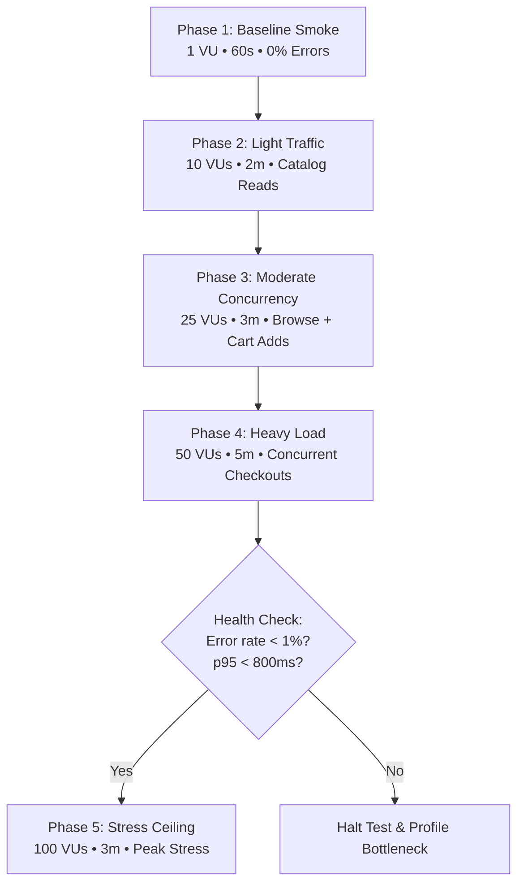
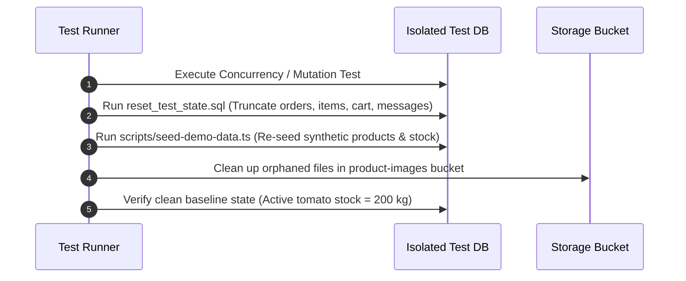

# UMA Market — Security & Resilience Test Plan

**Document Version:** 1.0.0-draft  
**Status:** Audit & Test Planning Only (Zero Active Attacks Executed)  
**Target Application:** UMA Market (Localized B2B Agricultural Procurement Platform)  
**Git Baseline:** `v0.1.0-pilot` (`main`)  
**Production URL:** [https://uma.xalhexi.wtf](https://uma.xalhexi.wtf)  

---

## 1. Environment Isolation Architecture

### 1.1 The Isolation Requirement

Currently, local development (`http://localhost:3000`) and production (`https://uma.xalhexi.wtf`) both connect to the same Supabase database instance, while using different Clerk environments (Clerk Development vs. Clerk Production).

**Destructive testing, concurrency race hammers, load tests, or fuzzing against the shared database are strictly prohibited.** Any testing of this nature would corrupt live production inventories, disrupt real pilot users, pollute audit histories, and risk service availability.

```
CURRENT (UNSAFE FOR SECURITY TESTING):
  Production (uma.xalhexi.wtf) ──► Clerk Prod ──► Shared Supabase DB (RISK!)
  Localhost (localhost:3000)   ──► Clerk Dev  ──► Shared Supabase DB (RISK!)

TARGET SECURITY TEST TOPOLOGY (FULLY ISOLATED):
  Production:
    uma.xalhexi.wtf
    └── Clerk Production Instance (pk_live_...)
        └── Dedicated Production Supabase Project

  Security & Resilience Test Environment:
    http://localhost:3001 (or dedicated test runner)
    └── Clerk Development Instance (pk_test_...)
        └── DEDICATED Supabase Security-Test Project (Separate URL & Keys)
            ├── Synthetic test users only
            ├── Synthetic catalog & demo products
            ├── Isolated storage bucket
            └── Dedicated database connection strings
```

### 1.2 Clerk Development Reuse Assessment

**Can we reuse the existing Clerk Development instance for security testing while connecting it to a separate Supabase project?**

**YES.** This is the recommended and safest configuration:

1. **Authentication Decoupling:** Clerk issues JWTs signed with its JSON Web Key Set (JWKS). In Supabase, third-party authentication validates incoming JWTs against Clerk's JWKS endpoint (`https://<clerk-dev-domain>/.well-known/jwks.json`).
2. **Dedicated Supabase Project:** By creating a standalone Supabase project (e.g., `uma-security-test`) and configuring its third-party auth to trust the existing Clerk Development issuer URL, tokens minted by Clerk Development will validate seamlessly in the test database.
3. **Data Isolation:** All database tables (`profiles`, `products`, `orders`, `messages`, etc.) and storage buckets reside entirely in the dedicated test project. Production tables remain untouched.
4. **Account Containment:** Pre-existing test accounts (`buyer.test@example.com`, `farmer.test@example.com`, `admin.test@example.com`) and dedicated security test personas (e.g., `attacker.farmer@example.com`, `attacker.buyer@example.com`) in Clerk Development are completely separate from production user identities (`pk_live_`).
5. **Configuration Rule:** The test environment must run with a dedicated `.env.test.local` file that points `NEXT_PUBLIC_SUPABASE_URL`, `NEXT_PUBLIC_SUPABASE_PUBLISHABLE_KEY`, and `SUPABASE_SECRET_KEY` exclusively to the security-test Supabase instance.

---

## 2. Attack Surface Inventory

Every entry point, execution boundary, and state container in the UMA Market repository has been audited:

### 2.1 Network & HTTP Layer
* **Public Pages:** `/`, `/products`, `/products/[id]`, `/about`, `/privacy`, `/terms`
* **Public API Health Endpoint:** `/api/health` (GET)
* **Webhook Ingestion Endpoint:** `/api/webhooks/clerk` (POST)
* **Authentication Handlers:** `/sign-in/[[...sign-in]]`, `/sign-up/[[...sign-up]]`
* **Onboarding Flow:** `/onboarding`, `/onboarding/complete`

### 2.2 Authenticated Dashboard Surfaces
* **Business Buyer Surfaces (`/business/*`):**
  * `/business`: Redirects to `/business/products`
  * `/business/products`: Product catalog with live search and category filtering
  * `/business/products/[id]`: Product detail and cart addition
  * `/business/cart`: Cart review, quantity adjustments, item removal
  * `/business/checkout`: Multi-farmer order grouping, fulfillment choice, address entry
  * `/business/checkout/confirmation/[orderId]`: Immutable order confirmation
  * `/business/orders`: Active and historical order listings
  * `/business/orders/[id]`: Stepped order status timeline, itemized receipt, order chat
  * `/business/messages`: Threaded counterparty communications
  * `/business/profile`: Commercial business profile management
* **Farmer Producer Surfaces (`/farmer/*`):**
  * `/farmer`: Redirects to `/farmer/orders`
  * `/farmer/orders`: Order management dashboard with status tab filtering
  * `/farmer/orders/[id]`: Order detail, customer contact, state-machine transition panel, order chat
  * `/farmer/products`: Active and draft catalog listings, inventory monitors
  * `/farmer/products/new`: Multi-attribute produce creation form with image gallery upload
  * `/farmer/products/[id]/edit`: Listing editor and gallery management
  * `/farmer/messages`: Threaded customer communication hub
  * `/farmer/profile`: Farm business profile, contact details, bio
* **Platform Governance Surfaces (`/admin/*`):**
  * `/admin`: High-level marketplace metrics and governance overview
  * `/admin/farmers`: Producer management and verification toggle
  * `/admin/businesses`: Commercial buyer directory
  * `/admin/orders`: Platform-wide order monitor
  * `/admin/orders/[id]`: Global order inspection
  * `/admin/products`: Marketplace catalog moderation (active/draft/archived)

### 2.3 Server Actions (`"use server"`)
Nine server action modules expose callable RPC endpoints to the browser:
1. `src/app/onboarding/actions.ts`: `completeOnboarding`
2. `src/app/(dashboard)/profile/actions.ts`: `updateProfile`
3. `src/app/(dashboard)/messages/actions.ts`: `sendMessage`
4. `src/app/(dashboard)/farmer/products/actions.ts`: `createProduct`, `updateProduct`, `archiveProduct`
5. `src/app/(dashboard)/farmer/orders/actions.ts`: `updateOrderStatus`
6. `src/app/(dashboard)/business/orders/actions.ts`: `cancelOrder`
7. `src/app/(dashboard)/admin/actions.ts`: `moderateProductStatus`, `toggleProfileVerification`
8. `src/app/(dashboard)/business/checkout/actions.ts`: `placeMultiFarmerCheckout`, `placeOrder`
9. `src/app/(dashboard)/business/cart/actions.ts`: `addToCart`, `updateCartItemQuantity`, `removeFromCart`

### 2.4 Supabase Storage
* **Bucket:** `product-images` (public read, authenticated write scoped to `products/{farmer_clerk_id}/*`)
* **Utilities:** `src/lib/supabase/storage.ts` (validation for 5MB limit, JPEG/PNG/WebP format, and safe deletion)

### 2.5 PostgreSQL Database Engine Layer
* **Tables:** `profiles`, `products`, `product_images`, `cart_items`, `orders`, `order_items`, `messages`, `categories`
* **Views:** `public_farmer_profiles` (privacy-hardened view omitting contact data)
* **Stored Procedures / RPCs:**
  * `place_checkout_orders(p_orders jsonb)`: Atomic multi-farmer checkout with row-level locks
  * `place_order(...)`: Atomic single-farmer checkout
  * `update_order_status(p_order_id uuid, p_new_status text, p_cancellation_reason text)`: Serialized state machine
* **Database Triggers:**
  * `trg_protect_profile_fields`: Prevents non-admin tampering of `is_verified` and `role`
  * `trg_enforce_order_terminal_status`: Rejects changes to `cancelled` or `completed` orders
  * `trg_restore_stock_on_cancelled`: Restores inventory strictly from pre-fulfillment states

---

## 3. Authorization Tests (Access Control & RBAC)

| Test ID | Objective | Threat Model / Action | Expected Result |
| :--- | :--- | :--- | :--- |
| **AUTHZ-01** | Horizontal Privilege Escalation (Buyer → Buyer Order) | Buyer A attempts to load `/business/orders/[Order-of-Buyer-B]` and queries Supabase `orders` for Buyer B's UUID. | Blocked by RLS (`business_clerk_id = auth.jwt()->>'sub'`). Returns 404 or empty result. |
| **AUTHZ-02** | Horizontal Privilege Escalation (Buyer → Buyer Cart) | Buyer A invokes `updateCartItemQuantity` or `removeFromCart` targeting a `cart_item_id` owned by Buyer B. | Blocked by `.eq("business_clerk_id", userId)` and RLS. Target item unmodified. |
| **AUTHZ-03** | Vertical Privilege Escalation (Buyer → Farmer Action) | Authenticated Buyer calls `createProduct` or `updateOrderStatus`. | Rejected by server-side `assertFarmer` assertion. Error returned: `"Unauthorized"`. |
| **AUTHZ-04** | Horizontal Privilege Escalation (Farmer → Farmer Product) | Farmer A submits `updateProduct` or `archiveProduct` specifying `product_id` owned by Farmer B. | Filtered by `.eq("farmer_clerk_id", userId)` and RLS. Product unmodified. |
| **AUTHZ-05** | Horizontal Privilege Escalation (Farmer → Farmer Order) | Farmer A executes `update_order_status` RPC on an order assigned to Farmer B. | Database RPC raises exception: `"Not authorized to update this order"`. |
| **AUTHZ-06** | Cross-Role Escalation (Farmer → Buyer Checkout) | Authenticated Farmer invokes `place_checkout_orders` RPC. | Database RPC raises exception: `"Only business users can place orders"`. |
| **AUTHZ-07** | Admin Privilege Escalation (Non-Admin → Admin Action) | Non-admin user calls `moderateProductStatus` or `toggleProfileVerification`. | Blocked in Server Action: `"Unauthorized. Admin role required."`. Service role client not invoked. |
| **AUTHZ-08** | Profile Role Tampering (Direct Update) | Farmer or Buyer invokes `updateProfile` or direct SQL attempting to set `role = 'admin'`. | Trigger `trg_protect_profile_fields` raises exception: `"Only administrators can modify profile role"`. |
| **AUTHZ-09** | Verification Badge Tampering | Unverified Farmer invokes `updateProfile` attempting to set `is_verified = true`. | Trigger `trg_protect_profile_fields` raises exception: `"Only administrators can modify profile verification status"`. |
| **AUTHZ-10** | Onboarding Role Escalation | User during `/onboarding` manipulates form submission payload to send `role = 'admin'`. | Server Action asserts `ALLOWED_ONBOARDING_ROLES = ['farmer', 'business']`. Throws exception. |
| **AUTHZ-11** | Unauthenticated Direct Action Invocation | Unauthenticated client POSTs directly to Server Action endpoints without Clerk cookie/JWT. | `auth()` returns null `userId`. Server Actions immediately return `"Unauthorized"`. |
| **AUTHZ-12** | Cross-Tenant Message Snoop | Buyer A attempts to fetch or subscribe to `/business/messages` on an order between Buyer B and Farmer B. | RLS policy `"messages: participants read"` checks order participation. Zero rows returned. |

---

## 4. Inventory & Concurrency Tests (Race Conditions)

| Test ID | Objective | Threat Model / Action | Expected Result |
| :--- | :--- | :--- | :--- |
| **CONC-01** | Last-Stock Race (Overselling Prevention) | Product has `quantity_available = 5 kg`. Two distinct buyers submit simultaneous checkouts for `5 kg` each at the exact same millisecond ($t_0$). | First transaction acquires `FOR UPDATE` lock, decrements stock to `0`, commits. Second transaction is rejected: `"Insufficient stock for [product] — available: 0 kg"`. Total stock never drops below zero. |
| **CONC-02** | Duplicate Checkout Replay | A buyer clicks "Place Order" twice in rapid succession (double-submission) or replays the network request. | First request decrements stock and deletes items from `cart_items`. Second request fails either due to empty cart or insufficient available stock. No duplicate orders created. |
| **CONC-03** | Buyer Cancellation vs. Farmer Acceptance Race | Buyer submits `cancelOrder` simultaneously as the Farmer submits `updateOrderStatus('accepted')`. | Serialized by database locks. If acceptance commits first, cancellation fails (`status != 'pending'`). If cancellation commits first, acceptance fails (`status == 'cancelled'`). System maintains deterministic consistency. |
| **CONC-04** | Farmer Double Transition | Farmer double-clicks "Accept Order" or fires two parallel requests transitioning `pending → accepted`. | First request updates row. Second request fails validation in `update_order_status` (`Invalid transition: accepted → accepted`). |
| **CONC-05** | Terminal State Tampering | Direct or scripted attempt to transition an order from `cancelled` back to `accepted` or `completed` to `cancelled`. | Trigger `trg_enforce_order_terminal_status` raises exception: `"Order is cancelled/completed and cannot be updated"`. |
| **CONC-06** | Multi-Farmer Atomic Rollback | Buyer checks out with items from Farm A (valid, 10 kg) and Farm B (invalid: exceeds stock by 1 kg). | `place_checkout_orders` executes in a single PostgreSQL transaction. Failure on Farm B rolls back entire batch. Neither Farm A nor Farm B order is created; stock is unchanged. |
| **CONC-07** | Inventory Restitution from Non-Restorable State | An order is in `ready` or `for_delivery`. A database manipulation attempts to mark it `cancelled` to trigger stock restoration. | Trigger `trg_restore_stock_on_cancelled` checks `OLD.status IN ('pending', 'accepted', 'preparing')`. No inventory is restored from `ready` or `for_delivery`, preventing phantom inventory inflation. |
| **CONC-08** | Minimum Order Quantity (MOQ) Bypass | Buyer submits a direct RPC call with `quantity = 1` for a product with `min_order_quantity = 5`. | Database RPC raises exception: `"Minimum order for [product] is 5 kg"`. Order is rejected. |

---

## 5. Input Validation & Abuse Tests

| Test ID | Objective | Threat Model / Action | Expected Result |
| :--- | :--- | :--- | :--- |
| **INPUT-01** | Negative Quantity Injection | Buyer submits `addToCart` or `place_order` with `quantity = -10`. | Server Action asserts `quantity > 0`; Database RPC enforces `quantity >= min_order_quantity > 0`. Request rejected. |
| **INPUT-02** | Numeric Overflow / Gigantic Quantities | Buyer submits `quantity = 9999999999` to trigger integer/numeric overflow or unexpected calculations. | Rebuffed by stock availability check (`quantity > quantity_available`). Database column `numeric(10,2)` protects against overflow. |
| **INPUT-03** | Negative Price Injection | Farmer submits `createProduct` or `updateProduct` with `price_per_unit = -50`. | Server Action validation rejects (`Price must be greater than 0`). Database check constraint rejects negative price. |
| **INPUT-04** | Malformed / Non-UUID Parameters | Attacker injects malformed strings (`abc-123`, `../../etc/passwd`, `' OR 1=1 --`) into route parameters (`/products/[id]`, `/farmer/orders/[id]`). | Database query returns error or empty result; Next.js router handles cleanly without crashing or exposing stack traces. |
| **INPUT-05** | Cross-Site Scripting (XSS) in Notes & Bio | Buyer injects `<script>alert(1)</script>` into order `notes`, or Farmer injects HTML into `bio` or `description`. | React automatically escapes JSX string rendering. Data stored safely as plain text; no script execution in DOM. |
| **INPUT-06** | Oversized Payloads | Attacker submits a 10MB JSON body to Server Actions or `/api/webhooks/clerk`. | Next.js body parser limit (default 1MB or 4MB) terminates request with HTTP 413 Payload Too Large. |
| **INPUT-07** | Message Spam / Rapid Ingestion | Script sends 500 messages per minute through `sendMessage`. | Database handles transactional insert; UI renders correctly. Note: highlights need for future application-level rate limiting. |

---

## 6. Authentication & Session Resilience Tests

| Test ID | Objective | Threat Model / Action | Expected Result |
| :--- | :--- | :--- | :--- |
| **AUTH-01** | Expired JWT Replay | Replaying an expired Clerk JWT against Supabase REST API or Server Actions. | Clerk SDK / Supabase rejects expired token with HTTP 401 Unauthorized. |
| **AUTH-02** | Signature Tampering | Modifying JWT payload (e.g. changing `sub` or `user_role`) without a valid cryptographic signature. | Cryptographic verification fails at Clerk middleware / Supabase auth gateway. |
| **AUTH-03** | Cross-Environment Token Injection | Using a token minted by Clerk Production (`pk_live_`) against the Security-Test Supabase instance. | JWT issuer mismatch (`iss` header). Supabase JWT verification fails. |
| **AUTH-04** | Session Revocation | User signs out in one browser tab; previous session token is immediately used in a second tab. | Next request fails authentication check; redirected to `/sign-in`. |
| **AUTH-05** | Deep Link Redirect | Unauthenticated visitor deep-links to `/admin/farmers` or `/farmer/orders`. | Redirected cleanly to `/sign-in`. No layout or sensitive data is rendered. |
| **AUTH-06** | Incomplete Onboarding Enforcement | User signs up but has not completed role selection (`user_role` is null). Deep-links to `/business/products`. | `DashboardLayout` catches missing role; redirects immediately to `/onboarding`. |

---

## 7. API & Server Action Security Specification

### 7.1 REST API Endpoints

```
ENDPOINT: GET /api/health
  Auth Required: No (Public)
  Rate Limit: Edge default
  Validation: None
  Data Returned: Static JSON {"status": "ok", "version": "0.1.0", "timestamp": "..."}
  Security Guardrail: Must never expose database connection strings, latency probes, or server memory metrics.

ENDPOINT: POST /api/webhooks/clerk
  Auth Required: Yes (Cryptographic Svix signature headers: svix-id, svix-timestamp, svix-signature)
  Signing Secret: CLERK_WEBHOOK_SIGNING_SECRET
  Validation: verifyWebhook(req) from @clerk/nextjs/webhooks
  Security Guardrail:
    - Rejects unsigned requests with HTTP 400.
    - Rejects timestamps older than 5 minutes (prevents replay attacks).
    - Uses service-role client ONLY for profile provisioning and user deletion cleanup.
```

### 7.2 Server Action Matrix

| Action Name | Source File | Required Role | Primary Security Controls |
| :--- | :--- | :--- | :--- |
| `completeOnboarding` | `src/app/onboarding/actions.ts` | Any Authenticated (no role yet) | Verifies user has no existing role; enforces role allowlist (`farmer`, `business`); rejects `admin`. |
| `updateProfile` | `src/app/(dashboard)/profile/actions.ts` | Authenticated | Updates only caller's profile (`eq("clerk_id", userId)`); DB trigger prevents modifying `role` or `is_verified`. |
| `sendMessage` | `src/app/(dashboard)/messages/actions.ts` | Authenticated | String trimming; RLS policy `"messages: participants insert"` verifies sender is order buyer or farmer. |
| `createProduct` | `src/app/(dashboard)/farmer/products/actions.ts` | `farmer` | Asserts farmer role; sets `farmer_clerk_id = userId`; verifies image path starts with `products/${userId}/`. |
| `updateProduct` | `src/app/(dashboard)/farmer/products/actions.ts` | `farmer` | Asserts farmer role; verifies ownership via `.eq("farmer_clerk_id", userId)` and RLS; verifies image ownership. |
| `archiveProduct` | `src/app/(dashboard)/farmer/products/actions.ts` | `farmer` | Soft-deletes (`status = 'archived'`); enforces farmer ownership. Never hard-deletes. |
| `updateOrderStatus` | `src/app/(dashboard)/farmer/orders/actions.ts` | `farmer` | Asserts farmer role; delegates to `update_order_status` RPC with `FOR UPDATE` lock and state-machine checks. |
| `cancelOrder` | `src/app/(dashboard)/business/orders/actions.ts` | `business` | Enforces `business` role; enforces `.eq("business_clerk_id", userId)` and `.eq("status", "pending")`. |
| `placeMultiFarmerCheckout` | `src/app/(dashboard)/business/checkout/actions.ts` | `business` | Asserts `business` role; delegates to `place_checkout_orders` atomic RPC with canonical product row locks. |
| `placeOrder` | `src/app/(dashboard)/business/checkout/actions.ts` | `business` | Asserts `business` role; delegates to `place_order` atomic RPC. |
| `addToCart` | `src/app/(dashboard)/business/cart/actions.ts` | `business` | Enforces `business` role; checks product is `active`, quantity >= MOQ, and quantity <= stock; upserts to `cart_items`. |
| `updateCartItemQuantity` | `src/app/(dashboard)/business/cart/actions.ts` | `business` | Enforces `business` role; scopes update to caller's `business_clerk_id`. |
| `removeFromCart` | `src/app/(dashboard)/business/cart/actions.ts` | `business` | Enforces `business` role; scopes delete to caller's `business_clerk_id`. |
| `moderateProductStatus` | `src/app/(dashboard)/admin/actions.ts` | `admin` | Asserts `sessionClaims?.user_role === "admin"`. Uses service-role client. Rejects non-admin callers. |
| `toggleProfileVerification` | `src/app/(dashboard)/admin/actions.ts` | `admin` | Asserts `sessionClaims?.user_role === "admin"`. Uses service-role client. Rejects non-admin callers. |

---

## 8. Browser & E2E Abuse Test Scenarios (Playwright)

Automated end-to-end tests designed to simulate aggressive or erratic human behavior:

### Scenario E2E-A: Rapid Double-Click Checkout
1. Launch browser as authenticated buyer (`buyer.test@example.com`).
2. Add produce to cart and navigate to `/business/checkout`.
3. Fill delivery details.
4. Using Playwright, trigger two rapid, non-debounced clicks on the "Place Order" button within 50ms.
5. **Assertion:** Only one order reference is generated. No double-charging or duplicate order creation occurs.

### Scenario E2E-B: Multi-Browser Inventory Exhaustion Race
1. Browser Context 1 logs in as Buyer A.
2. Browser Context 2 logs in as Buyer B.
3. Both navigate to the same produce listing with `5 kg` in stock.
4. Both configure carts for `5 kg`.
5. Simultaneously click "Place Order" across both contexts.
6. **Assertion:** One browser receives confirmation (`Order Placed Successfully!`); the second receives an explicit, graceful error notification (`Insufficient stock`). Stock ends exactly at `0 kg`.

### Scenario E2E-C: Realtime Chat Flood
1. Open two browser windows: Buyer on `/business/orders/[id]` and Farmer on `/farmer/orders/[id]`.
2. Programmatically dispatch 20 messages in rapid succession from Buyer.
3. **Assertion:** Realtime WebSocket subscriptions deliver messages in order; UI auto-scrolls smoothly; no client-side memory leakage or rendering failure occurs.

---

## 9. Load & Stress Test Plan (k6)

> **CRITICAL RULE:** All load and stress testing must target **ONLY** the isolated security-test environment (`http://localhost:3001` or dedicated staging server) connected to the dedicated test database. **Zero load traffic may touch `uma.xalhexi.wtf` or the production database.**

### 9.1 Phased Ramp-Up Protocol



* **Phase 1: Baseline (1 Virtual User - 60 seconds):**
  * Verifies script correctness, auth token retrieval, and HTTP 200 responses.
* **Phase 2: Light Traffic (10 VUs - 2 minutes):**
  * Target: Public landing page, `/products` catalog browsing, category filtering.
  * Target Metrics: $p_{95} < 250\text{ ms}$, $0\%$ errors.
* **Phase 3: Moderate Concurrency (25 VUs - 3 minutes):**
  * Target: Catalog browsing + individual product page loads (`/products/[id]`) + cart mutations.
  * Target Metrics: $p_{95} < 500\text{ ms}$, $< 0.1\%$ errors.
* **Phase 4: Heavy Concurrent Mutations (50 VUs - 5 minutes):**
  * Target: Simulated buyers executing checkout RPCs (`place_checkout_orders`) competing for synthetic inventory.
  * Target Metrics: Database connection pool stability, $p_{95} < 800\text{ ms}$, clean rollback handling.
* **Phase 5: Stress Ceiling (100 VUs - 3 minutes):**
  * Executed **only** if Phase 4 passes with healthy server metrics. Establishes the saturation threshold of the Next.js and Supabase test tiers.

---

## 10. Security Tooling Mapping

| Test Category | Primary Tool | Methodology & Role |
| :--- | :--- | :--- |
| **Passive & Active Web Scanning** | **OWASP ZAP** | Automated scan for security headers (HSTS, CSP, X-Frame-Options), cookie flags (`HttpOnly`, `SameSite`), information leakage in error pages, and open redirects. |
| **Targeted Manual Manipulation** | **Burp Suite Community / Pro** | Intercepting and tampering with Server Action payloads, modifying JSON fields, token tampering, and replaying order placement requests. |
| **Load & Stress Testing** | **Grafana k6** | Headless JavaScript load testing simulating concurrent HTTP/WebSocket traffic against isolated test endpoints. |
| **Browser Concurrency & UI Races** | **Playwright** | Multi-context Chromium execution simulating simultaneous human buyer and farmer actions in real browser DOMs. |
| **Transactional Concurrency** | **Direct SQL / Node.js Harness** | Direct PostgreSQL test harness using `pg` or `@supabase/supabase-js` to fire microsecond-level concurrent transactions testing row-level locks and isolation levels. |

---

## 11. Success & Evaluation Criteria

* **PASS:**
  * Expected security controls, state machines, or RLS policies strictly enforce access limits.
  * Invalid or malicious inputs are rejected with appropriate error statuses (HTTP 400, 401, 403, or DB exception) without system failure.
  * Stock levels, balances, and states remain 100% deterministic and mathematically correct after concurrent execution.
* **FAIL:**
  * Unauthorized read or write access across roles or tenants (horizontal/vertical privilege escalation).
  * Inventory overselling (stock decrements below zero).
  * System crash, unhandled runtime exception exposing environment secrets or stack traces to the client.
  * Corrupted state machine (e.g. order jumps from `pending` directly to `completed`).
* **WARNING:**
  * Request succeeds without authorization compromise, but response time exceeds acceptable threshold ($p_{95} > 1500\text{ ms}$).
  * Missing application-level rate limiting on endpoints vulnerable to volumetric spam (e.g. order chat or search querying).
* **NOT TESTABLE:**
  * Tests requiring destruction of third-party infrastructure (e.g. attacking Clerk's core authentication clusters or Supabase managed cloud control plane).

---

## 12. Evidence Collection & Reporting Standard

For every security and resilience test executed, the testing team must document:
1. **Identifier & Metadata:** Test ID, execution timestamp, tester identity, and environment revision git commit hash.
2. **Raw Request & Response:** Exact HTTP headers, payloads, query parameters, status codes, and response bodies.
3. **Database State Audit:** Pre-test SQL query snapshot vs. Post-test SQL query snapshot (verifying exact row counts, stock values, and timestamps).
4. **Application Logs:** Relevant Next.js stdout/stderr logs and PostgreSQL server log entries.
5. **Reproduction Artifact:** Minimum viable reproduction command (curl snippet, k6 script, or Playwright test file).
6. **Visual Proof:** Screenshots or screen recordings for browser-level anomalies.

---

## 13. Cleanup & Environment Reset Strategy

Every destructive or state-changing test scenario must have an automated reset plan:



1. **State Reset Script (`reset_test_state.sql`):**
   * Empties `public.orders`, `public.order_items`, `public.cart_items`, and `public.messages`.
   * Restores synthetic product inventory (`quantity_available`) to standard baseline values.
2. **Storage Reset:**
   * Removes temporary test image uploads created during product creation tests from `product-images` bucket.
3. **Automated Verification:**
   * Re-runs sanity query before the next test phase begins to ensure zero test cross-contamination.

---

## 14. Production Safety Rules

The following rules are non-negotiable across all testing phases:

1. **NEVER** run load tests, stress tests, fuzzers, or penetration scanners (ZAP, Burp, k6) against `https://uma.xalhexi.wtf` or its associated production Supabase instance.
2. **NEVER** utilize real user credentials, personal email addresses, or authentic business profiles in test scenarios.
3. **NEVER** modify, overwrite, or delete production database records.
4. **NEVER** commit `.env`, `.env.local`, `.env.test`, API secret keys, service-role keys, or JWT tokens to version control.
5. **ALWAYS** halt testing immediately if any network request inadvertently routes to the production domain or production database reference.

---

## 15. Recommended Test Campaign Execution Order

Execute the security and resilience test campaign in strict ascending order of operational risk:

1. **Phase 1: Environment Isolation Verification**
   * Confirm test environment is 100% disconnected from production Supabase database.
2. **Phase 2: Baseline Functional Sanity**
   * Execute smoke tests to verify test environment compiles, renders, and completes standard golden demo flow.
3. **Phase 3: Authorization & Access Control (AUTHZ-01 to AUTHZ-12)**
   * Test cross-role, cross-tenant, and admin boundary protections. Low risk to system stability.
4. **Phase 4: Input Validation & Boundary Testing (INPUT-01 to INPUT-07)**
   * Verify negative numbers, malformed UUIDs, and oversized payloads.
5. **Phase 5: Concurrency & Race Conditions (CONC-01 to CONC-08)**
   * Run targeted race condition scripts against the isolated database (last-stock race, duplicate checkout, status conflicts).
6. **Phase 6: API & Webhook Abuse**
   * Test Clerk webhook signature verification and direct Server Action invocations.
7. **Phase 7: Browser E2E Abuse Scenarios (Playwright)**
   * Run rapid double-click and multi-browser competition tests in real browser DOMs.
8. **Phase 8: Gradual Load & Stress Testing (k6)**
   * Ramp from 1 VU → 10 VUs → 25 VUs → 50 VUs on isolated test server.
9. **Phase 9: Comprehensive Regression & Final Reporting**
   * Run final database audit, execute cleanup scripts, and synthesize findings into the final Security Assessment Report.
